class: center, middle, inverse

# 犯罪収益移転防止法
## 本人確認手段（施行規則第六条）の解説
### eKYC導入検討エンジニア向け実務ガイド

---

# アジェンダ

1. **本人確認（KYC）の全体像**
2. **本資料の準拠バージョンと改正予定**
3. **自然人の本人確認手段（イ〜ヨ）**
   - 郵送・対面モデル（イ〜ニ、リ〜ヲ）
   - eKYCモデル（ホ〜ト、ル）
   - 公的個人認証・電子署名モデル（ワ〜ヨ）
4. **法人の本人確認手段**
5. **補完書類と実務上の留意点**

---

# アジェンダ

1. **本人確認（KYC）の全体像**
2. <span style="color: #ccc;">本資料の準拠バージョンと改正予定</span>
3. <span style="color: #ccc;">自然人の本人確認手段（イ〜ヨ）</span>
4. <span style="color: #ccc;">法人の本人確認手段</span>
5. <span style="color: #ccc;">補完書類と実務上の留意点</span>

---

# 本人確認（KYC）の全体像

### 顧客確認（CDD）の重要性
- 特定事業者は、取引の開始時に顧客の本人特定事項を確認する義務があります。
- マネー・ローンダリングおよびテロ資金供与対策（AML/CFT）の基盤となります。

### 本人確認の三要素
1. **本人特定事項**: 氏名、住居、生年月日（自然人の場合）
2. **取引目的**: 取引を行う目的の確認
3. **職業・事業内容**: 顧客の属性確認

---

# アジェンダ

1. <span style="color: #ccc;">本人確認（KYC）の全体像</span>
2. **本資料の準拠バージョンと改正予定**
3. <span style="color: #ccc;">自然人の本人確認手段（イ〜ヨ）</span>
4. <span style="color: #ccc;">法人の本人確認手段</span>
5. <span style="color: #ccc;">補完書類と実務上の留意点</span>

---

# 本資料の準拠バージョン

### 準拠している条文
- **犯罪による収益の移転防止に関する法律施行規則（第六条）**
- **2025年（令和7年）6月施行分まで反映済み**
  - 第六条第一項第一号「ル」（スマホ用電子証明書）を含む最新の内容です。

### 留意事項
- 犯収法は「イロハ...」の命名が改正時期により変動することがあります。
- 本資料は、**「ル」方式が追加された2025年6月改正後**のラベリングに基づいています。

---

# 改正のロードマップ（2025年〜2027年）

| 時期 | 主な変更点 |
|------|------------|
| **2024年12月** | 健康保険証の新規発行停止に伴い、本人確認書類から順次除外（経過措置あり） |
| **2025年6月** | **方式「ル」の新設**: スマホ用電子証明書による確認が可能に |
| **2027年4月(予定)** | **大規模改正**: セキュリティリスクの高い方式（ホ・リ）の廃止、JPKIへの一本化推進。**新方式「カ」「ヨ」の新設**。 |

---

# 2027年4月 改正のポイント

2027年4月以降、**「券面の画像を送るだけ」の本人確認は原則廃止**され、ICチップ活用が必須となります。

### 主な変更点
- **券面撮影方式の廃止**: 偽造対策のため、スマホカメラによる「厚み」や「表面」の撮影（ホ方式等）が認められなくなります。
- **ICチップ活用の義務化**: 全ての非対面方式において、マイナンバーカード等のICチップ読み取りが必須となります。
- **方式記号の再編**: 全体的に記号が振り直され、JPKI（ワ→ヘ）やICチップ方式（ヘ→ト）の順序が変わります。

---

# 本人確認手段の分類

| 分類 | 方式（号） | 特徴 |
|------|------------|------|
| **対面・郵送** | イ、ロ、ハ、ニ、チ、リ、ヌ、ヲ | 書類提示、書留郵便の送付など |
| **eKYC (容貌)** | ホ、ヘ、ト | スマホアプリでの容貌＋書類撮影 |
| **デジタル認証** | ル、ワ、カ、ヨ | マイナンバーカード、電子署名、公的個人認証 |
| **振込等** | ト(2) | 他社での確認状況や預貯金口座への振込を利用 |

---

# アジェンダ

1. <span style="color: #ccc;">本人確認（KYC）の全体像</span>
2. <span style="color: #ccc;">本資料の準拠バージョンと改正予定</span>
3. **自然人の本人確認手段（イ〜ヨ）**
4. <span style="color: #ccc;">法人の本人確認手段</span>
5. <span style="color: #ccc;">補完書類と実務上の留意点</span>

---

# 自然人の本人確認（イ〜ニ）
## 伝統的な郵送・対面方式

| 方式 | 概要 | 備考 |
|:---:|:---|:---|
| **イ** | 写真付き書類の提示（対面） | 運転免許証、マイナンバーカード等 |
| **ロ** | 写真なし書類の提示 ＋ 転送不要郵便 | 保険証等 ＋ 住所確認のハガキ |
| **ハ** | 本人確認書類2点の提示 | 対面での確認 |
| **ニ** | 書類1点提示 ＋ 他の書類(写し)の送付 | 補完書類の活用 |

---

# 自然人の本人確認（ホ〜ト）
## eKYC（オンライン本人確認）モデル

| 方式 | 概要 | 2027年4月〜 |
|:---:|:---|:---|
| **ホ** | 容貌の撮影 ＋ 写真付き書類の撮影 | **廃止予定** |
| **ヘ** | 容貌の撮影 ＋ ICチップ情報の送信 | 存続（推奨） |
| **ト** | 書類撮影/IC読み取り ＋ 振込等 | 銀行連携による確認 |

---

# 自然人の本人確認（リ〜ヨ）
## 特殊な郵送・デジタル認証モデル

| 方式 | 概要 | 備考 |
|:---:|:---|:---|
| **リ** | 書類(写し)の送付 ＋ 転送不要郵便 | **2027年廃止予定** |
| **ヌ** | 特殊条件下(法人被用者等)での写し送付 | 送付 ＋ 転送不要郵便 |
| **ル** | スマホ用電子証明書の送信 | **2025年6月新設** |
| **ヲ** | 本人限定受取郵便による送付 | 郵便局での本人確認代行 |
| **ワ〜ヨ** | 公的個人認証・電子署名 | マイナカード/認定事業者等 |

---

# 【方式カ・ヨ】デジタル認証（改正対応）

2027年4月の改正で、主に**マイナンバーカードを持たない海外居住者等**を対象とした新たなデジタル確認方式が実用化されます。

### 方式「カ」
- **内容**: 公的個人認証法に基づき発行された署名用電子証明書を用いる方法。
- **背景**: 現行の「カ」は公的個人認証のバリエーションとして整理されています。

### 方式「ヨ」
- **内容**: 総務大臣等の認定を受けた署名検証者が発行する電子証明書を用いる方法。
- **実務**: JPKI（ワ）と同等の信頼性を持つ民間等サービスを活用。

---

# アジェンダ

1. <span style="color: #ccc;">本人確認（KYC）の全体像</span>
2. <span style="color: #ccc;">本資料の準拠バージョンと改正予定</span>
3. <span style="color: #ccc;">自然人の本人確認手段（イ〜ヨ）</span>
4. **法人の本人確認手段**
5. <span style="color: #ccc;">補完書類と実務上の留意点</span>

---

# 4. 外国人・法人の本人確認（二・三）

- **二**: 外国人（旅券等の提示）
- **三**: 法人
  - **イ**: 本人確認書類の提示
  - **ロ**: 登記情報の提供 ＋ 転送不要郵便
  - **ハ**: 公表事項の確認 ＋ 転送不要郵便
  - **ニ**: 本人確認書類（写し）の送付 ＋ 転送不要郵便
  - **ホ**: 電子証明書（商業登記）の送信

---

# アジェンダ

1. <span style="color: #ccc;">本人確認（KYC）の全体像</span>
2. <span style="color: #ccc;">本資料の準拠バージョンと改正予定</span>
3. <span style="color: #ccc;">自然人の本人確認手段（イ〜ヨ）</span>
4. <span style="color: #ccc;">法人の本人確認手段</span>
5. **補完書類と実務上の留意点**

---

# 5. 補完書類と実務上の留意点（二項〜四項）

- **補完書類**: 現在の住居の記載がない場合の追加書類
- **営業所等への送付**: 法人顧客の特例
- **役職員による交付**: 郵送に代わる手渡しでの確認

---

# 【方式イ】写真付き書類の提示（対面）

.left-column[
### 概要
本人（または代表者等）から、**写真付き本人確認書類**の提示を直接受ける方法。

### 対象書類
- 運転免許証
- マイナンバーカード
- パスポート（住所記載があるもの）
- 在留カード
- 官公庁発行の顔写真付き書類
]

.right-column[
### 実務上のフロー
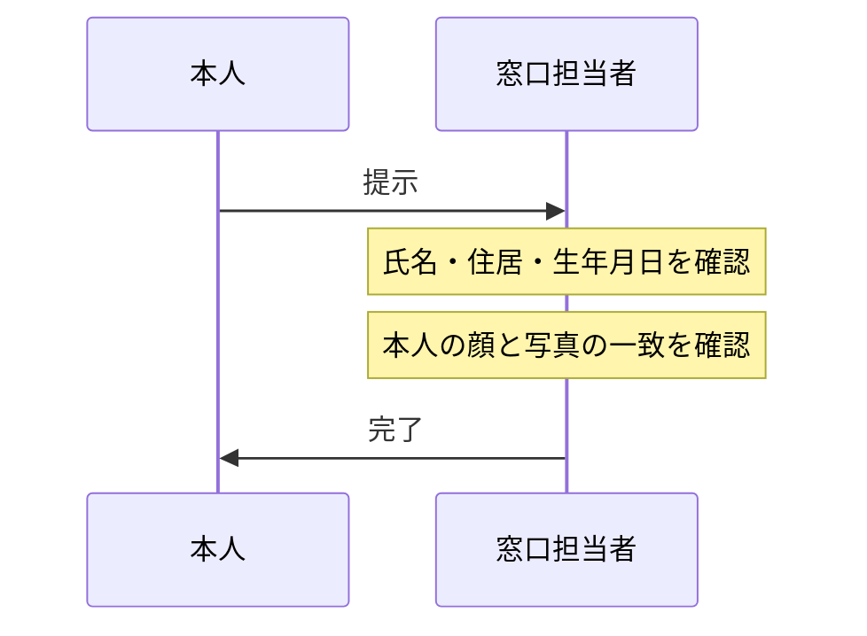
]

---

# 【方式ロ】写真なし書類提示 ＋ 転送不要郵便

.left-column[
### 概要
写真なし書類の提示を受け、かつ、住居宛に**転送不要郵便**を送付する方法。

### 対象書類
- 健康保険証（※経過措置期間に注意）
- 国民年金手帳
- 児童扶養手当証書 など
]

.right-column[
### 実務上のフロー
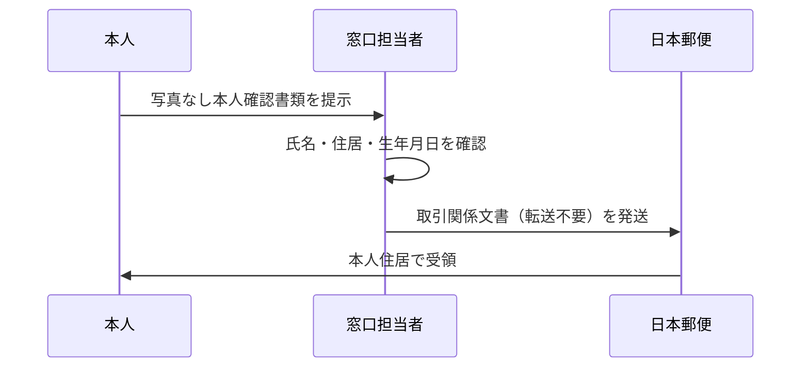
]

---

# 【方式ハ】書類2点の提示（対面）

.left-column[
### 概要
対面において、特定の書類を2点（または1点＋補完書類）提示受ける方法。

### パターン
1. **書類2点**: 住民票の写し ＋ 健康保険証 など
2. **書類1点 ＋ 補完書類**: 健康保険証 ＋ 公共料金領収書 など

### 補完書類とは
- 国税・地方税の領収書
- 公共料金（電気・ガス・水道）の領収書
- 発行から6ヶ月以内のものに限る
]

.right-column[
### 実務上のフロー
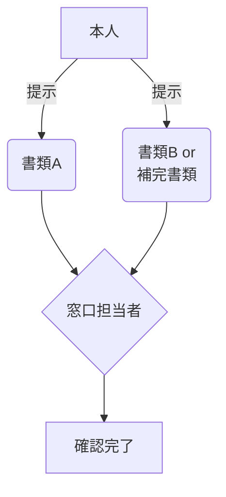
]

---

# 【方式ニ】書類1点提示 ＋ 他の書類（写し）の送付

.left-column[
### 概要
対面で1点（住民票等）提示を受け、かつ、別の書類の**送付（郵送等）**を受ける方法。

### ステップ
1. 対面で書類（例：住民票の写し）の提示を受ける。
2. 他の書類（例：健康保険証の写し）の送付を受ける。

### エンジニアの視点
- 対面と非対面（郵送/WEB）の併用モデル。
- 複数チャネル間のデータ突合ロジックが必須。
]

.right-column[
### データの流れ
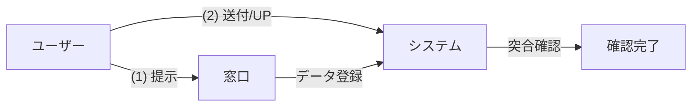
]

---

# 【方式ホ】容貌の撮影 ＋ 写真付き書類の撮影

.left-column[
### 概要
アプリ等を使用して、**「本人の容貌」**と**「写真付き本人確認書類」**を撮影・送信する方法。

### ⚠️ 2027年4月 改正注意
- 本方式は**廃止**される予定です。
- 偽造書類による不正への対策として、ICチップ読み取り（ヘ）や公的個人認証（ル〜ヨ）への移行が求められます。
]

.right-column[
### eKYCフロー (セルフィー方式)
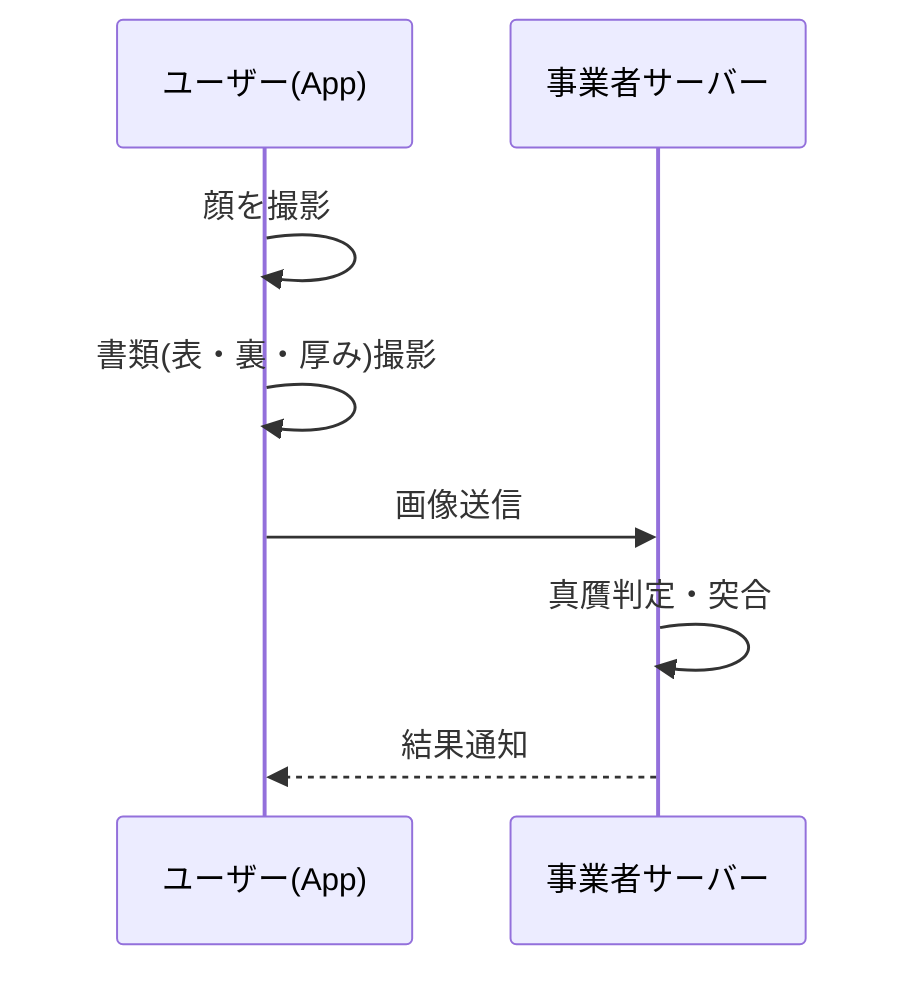
]

---

# 【方式ヘ】容貌の撮影 ＋ ICチップ情報の送信

.left-column[
### 概要
**「本人の容貌」**の撮影と、本人確認書類の**「ICチップ内情報」**の送信を組み合わせる方法。

### メリット
- 書類の偽造判定がICチップの署名検証で可能。
- 入力の手間が省ける（OCR不要）。
- 厚みの撮影が不要。
- **2027年以降も存続する主要な非対面方式**です。
]

.right-column[
### eKYCフロー (ICチップ読み取り)
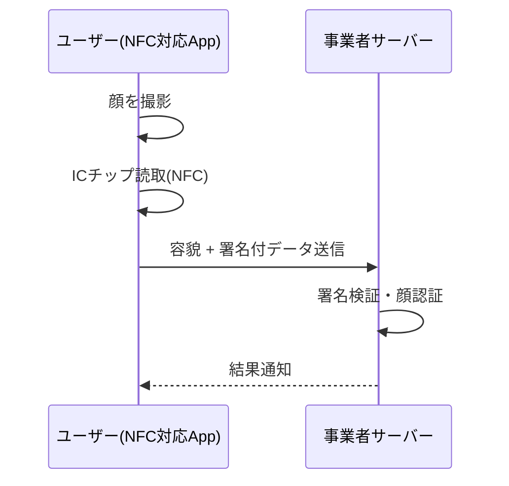
]

---

# 【方式ト(1)】書類撮影/IC読取 ＋ 金融機関API

.left-column[
### 概要
**「書類撮影またはIC読取」**を行い、かつ、**「他の特定事業者が確認済みの情報」**をAPI等を通じて確認する方法。

### ステップ
1. 書類（またはICチップ）により本人確認。
2. 他の金融機関（銀行等）からAPIで本人特定事項の提供を受ける。

### ポイント
- ユーザーは既に銀行口座等を持っていることが前提。
- 銀行側のAPI提供状況に依存する。
]

.right-column[
### 金融機関API連携フロー
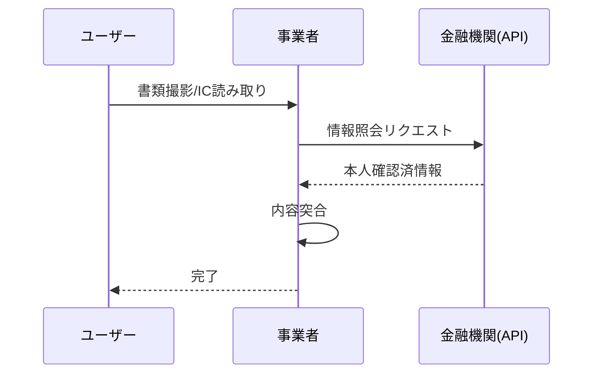
]

---

# 【方式ト(2)】書類撮影/IC読取 ＋ 銀行振込

.left-column[
### 概要
**「書類撮影またはIC読取」**を行い、かつ、顧客の預貯金口座へ**「少額振込」**等を行うことで確認する方法。

### 確認の組み合わせ
- 書類撮影/IC読取
- ＋ 顧客口座への振込
- ＋ **預貯金通帳の写し**等の送付

### 注意点
- 振込履歴が記載された通帳や画面キャプチャの送付が必要。
]

.right-column[
### 銀行振込フロー
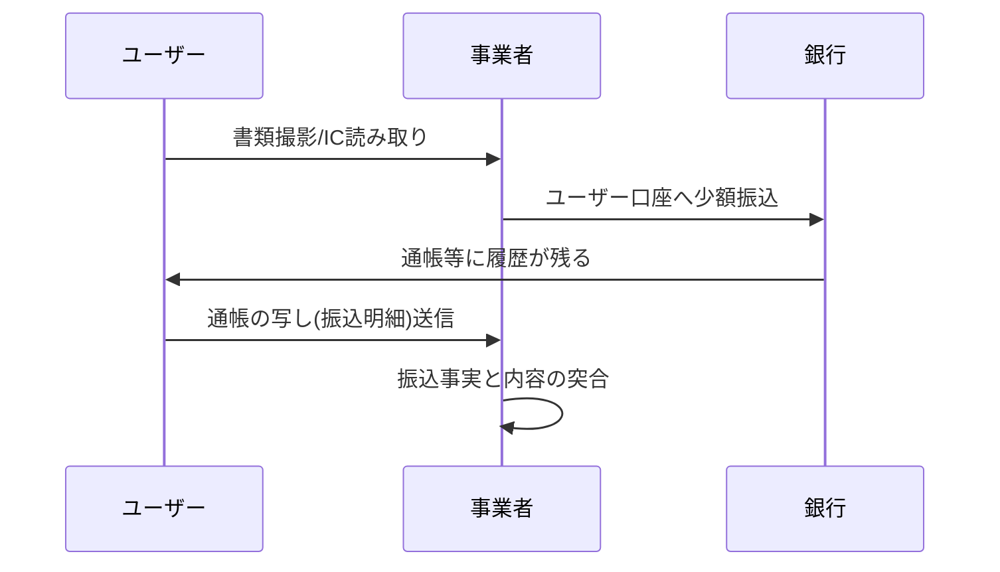
]

---

# 【方式チ】書類送付 ＋ 転送不要郵便

.left-column[
### 概要
本人確認書類の**「送付（郵送）」**を受け、かつ、その住居に**「転送不要郵便」**を送付する方法。

### 特徴
- 非対面での伝統的な郵送モデル。
- **2027年以降も存続**。ただし「写し」ではなく「原本（住民票等）」の送付が基本となります。
]

.right-column[
### 郵送サイクル
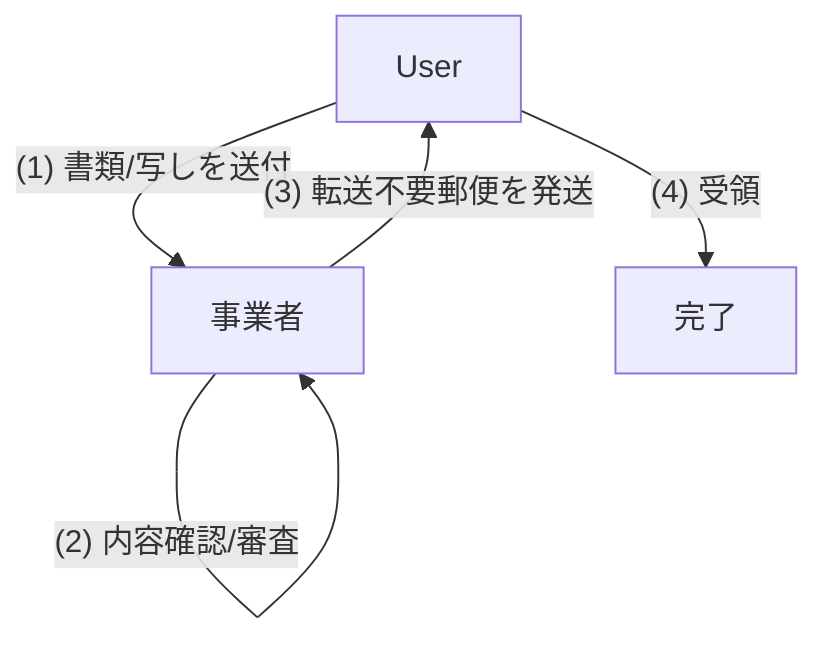
]

---

# 【方式リ】書類（写し）の送付 ＋ 転送不要郵便

.left-column[
### 概要
本人確認書類の**「写し（コピー）」**を2点（または1点＋補完書類）送付受け、かつ、転送不要郵便を送る方法。

### ⚠️ 2027年4月 改正注意
- **方式「リ」は廃止**される予定です。
- 非対面の郵送方式は、原本（住民票等）を送付する「チ方式」へ一本化されます。
]

.right-column[
### 概要図
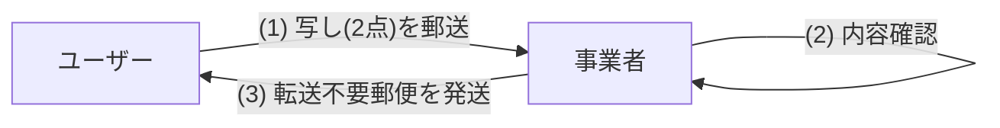
]

---

# 【方式ヌ】法人の被用者等による写し送付 ＋ 転送不要郵便

.left-column[
### 概要
**法人の被用者等（従業員等）**が顧客となる場合に、その法人が権限を証明し、本人確認書類の写しを送付する方法。

### 特徴
- 職域での契約（団体契約等）で利用される。
- 被用者本人からではなく、法人の担当部署等からまとめて書類が届く場合も含む。
]

.right-column[
### 確認の流れ
```mermaid
graph TD
    Corp[契約法人] --(1) 権限証明 + 写し送付--> Biz[事業者]
    Biz --(2) 被用者個人の住所確認--> Biz
    Biz --(3) 転送不要郵便を個人へ発送--> User[被用者(本人)]
```
]

---

# 【方式ル】スマホ用電子証明書（マイナンバーカード代替）

.left-column[
### 概要
マイナンバーカードの機能をスマホに搭載した**「スマホ用電子証明書」**を利用して確認する方法。

### 導入の背景
- **2025年6月改正で追加**された最新の方式です。
- カードを持ち歩かなくても、スマホ完結で確実な本人確認が可能。
- **2027年以降の推奨方式**の一つです。
]

.right-column[
### フロー
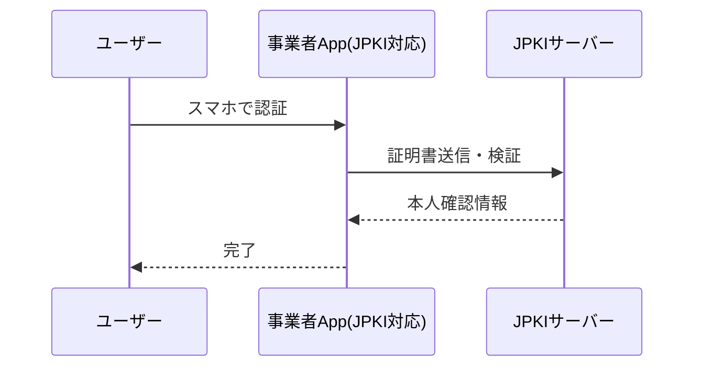
]

---

# 【方式ヲ】本人限定受取郵便（特定事項伝達型）

.left-column[
### 概要
郵便局員が対面で本人確認を行い、その結果を特定事業者に伝達することを条件に郵便物を送付する方法。

### 特徴
- 事業者が直接書類を見るのではなく、**郵便局が確認を代行**する形になる。
]

.right-column[
### フロー
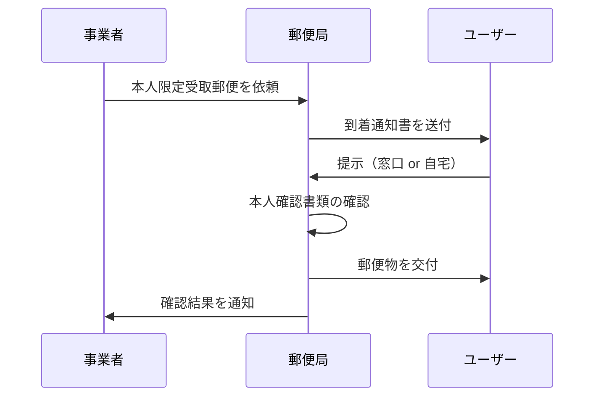
]

---

# 【方式ワ】公的個人認証（JPKI）

.left-column[
### 概要
マイナンバーカードのICチップ内の**「署名用電子証明書」**を利用して本人確認を行う方法。

### 特徴
- 署名用パスワード（6〜16桁）の入力が必要。
- **最も信頼性が高く、即時に確認が完了**する。
- 2027年以降、非対面KYCの主軸となる方式。
]

.right-column[
### JPKIフロー
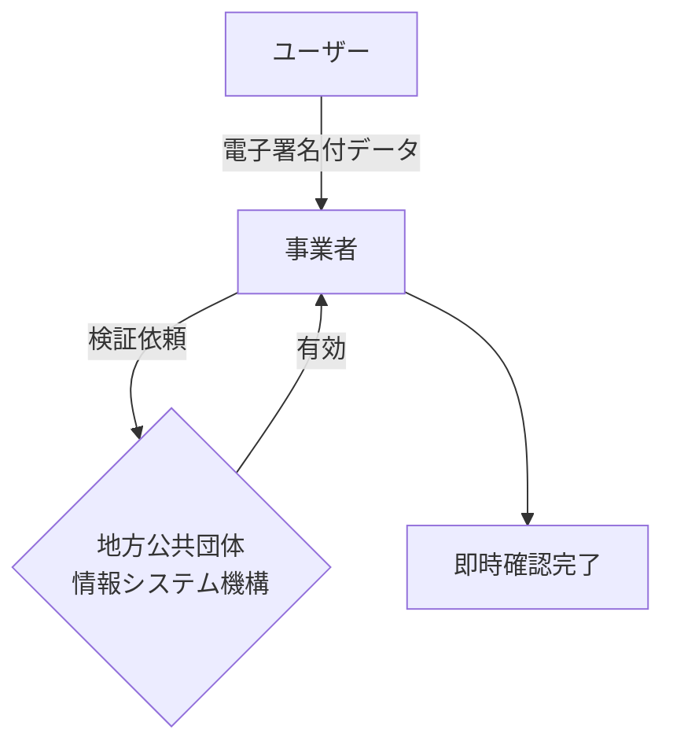
]

---

# 【方式カ・ヨ】認定事業者等による電子署名

.left-column[
### 方式「カ」
- **内容**: 特定認証業務（認定認証事業者）が発行する電子証明書を用いる。
- **背景**: JPKI以外の民間認証局等が発行する証明書による確認。

### 方式「ヨ」
- **内容**: 総務大臣等の認定を受けた署名検証者が発行する電子証明書を用いる。
- **実務**: JPKI（ワ）と同等の信頼性を持つ民間等の高度な認証サービスを活用。
]

.right-column[
### 認定事業者モデル
```mermaid
graph TD
    User[ユーザー] -->|電子署名付データ| Biz[事業者]
    Biz -->|検証依頼| Auth{認定事業者<br/>(民間等)}
    Auth -->|有効| Biz
    Biz --> Done[確認完了]
```
]

---

# 【二号】外国人の本人確認

.left-column[
### 概要
法第四条第一項第一号に規定する**外国人**（特定の取引を行う者）の確認方法。

### 確認書類
- **旅券（パスポート）**
- **乗員手帳**
- **船舶観光上陸許可書**

### 注意点
- 氏名、生年月日、特定の事項の記載があるものに限る。
]

.right-column[
### 確認ポイント
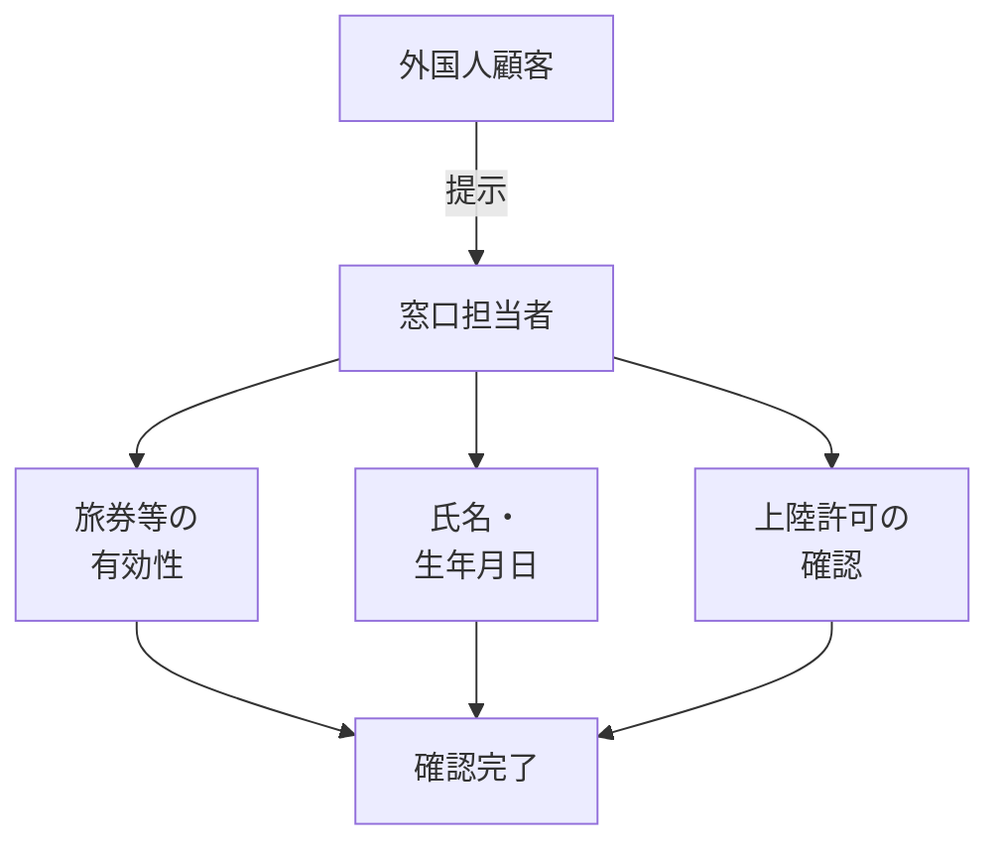
]

---

# 【三号イ・ニ】法人の本人確認（提示・郵送）

.left-column[
### 概要
法人の本人確認（名称・本店所在地）と、**代表者等**（来店者）の権限確認をセットで行う。

### 方式
- **イ（提示）**: 法人の本人確認書類（履歴事項全部証明書等）を提示。
- **ニ（郵送）**: 法人の本人確認書類（または写し）を送付 ＋ 本店等へ転送不要郵便。
]

.right-column[
### 実務構成
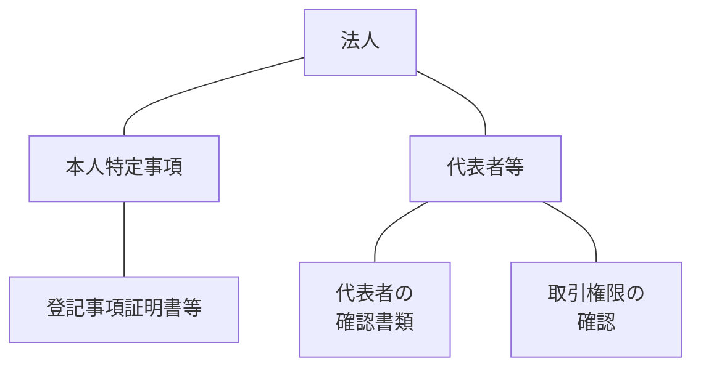
]

---

# 【三号ロ・ハ】法人の本人確認（API・公表事項）

.left-column[
### 概要
物理的な書類ではなく、**登記情報サービス**や**法人番号公表サイト**を利用して確認する方法。

### 方式
- **ロ**: 指定法人から**登記情報**の送信を受ける（＋非対面時は郵送）。
- **ハ**: **法人番号公表サイト**等の公表事項を確認（＋非対面時は郵送）。
]

.right-column[
### システム連携フロー
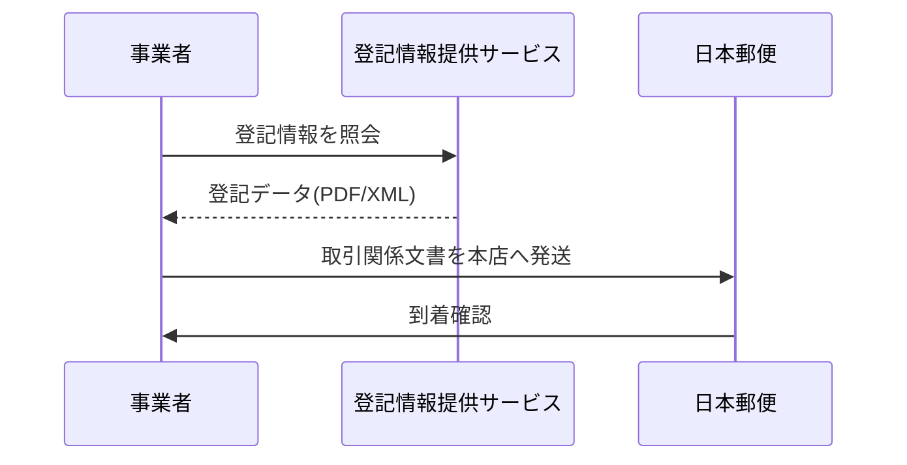
]

---

# 【三号ホ】法人の本人確認（電子証明書）

.left-column[
### 概要
登記官が作成した**電子証明書**（商業登記電子証明書）の送信を受ける方法。

### エンジニアの視点
- 法人の電子署名をシステムで自動検証可能。
- 完全オンライン完結の法人KYCを実現。
- 商業登記の署名検証ロジックの実装が必要。
]

.right-column[
### デジタル法人確認
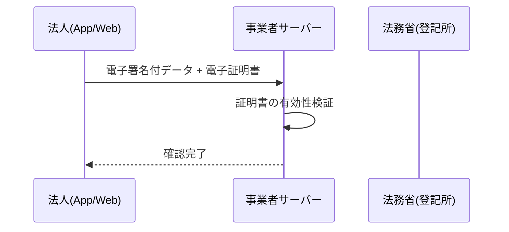
]

---

# 【二項】補完書類による住所確認

.left-column[
### 概要
本人確認書類に**「現在の住居」**の記載がない場合、追加で提示・送付を受ける書類。

### 主な補完書類
1. 国税・地方税の領収書・納税証明書
2. 社会保険料の領収書
3. 公共料金（電気・ガス・水道）の領収書
]

.right-column[
### 有効期限のルール
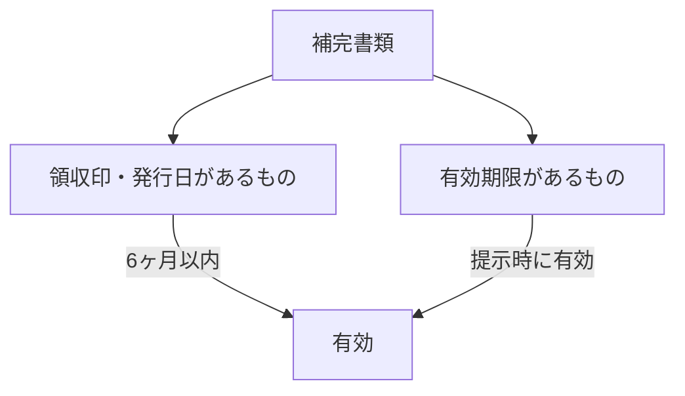
]

---

# 【三項・四項】営業所送付・役職員による交付

.left-column[
### 営業所への送付（三項）
- 法人顧客の場合、本店等ではなく**営業所**宛に取引関係文書を送付できる特例。

### 役職員による交付（四項）
- 郵送（書留・転送不要）に代えて、事業者の**役職員が直接赴いて**手渡しする方法。
]

.right-column[
### 役職員交付のフロー
```mermaid
sequenceDiagram
    participant Biz as 事業者
    participant Staff as 担当者
    participant User as 顧客(自宅/本店)
    Biz->>Staff: 書類を託す
    Staff->>User: 訪問
    User->>Staff: 本人確認書類を提示
    Staff->>User: 取引関係文書を手渡し
    Staff->>Biz: 完了報告
```
]

---

# 【付録】2027年4月 改正前後の方式対照表

| 現行方式 | 改正後(予定) | 概要 | 変更内容・備考 |
|:---:|:---:|:---|:---|
| **ホ** | **廃止** | 容貌 ＋ 書類撮影 | **廃止**。券面撮影が廃止され、ICチップ読み取り必須へ。 |
| **ヘ** | **ト** | 容貌 ＋ ICチップ | 存続。名称変更。券面撮影は不要（ICのみ）。 |
| **ト(1)** | **リ** | ICチップ ＋ API | 存続。名称変更。 |
| **ト(2)** | **廃止** | 書類撮影 ＋ 銀行振込 | **廃止**。書類撮影を伴うため。 |
| **リ** | **廃止** | 写し送付 ＋ 郵送 | **廃止**。原本（住民票等）送付の「チ」へ一本化。 |
| **ル** | **ヲ** | スマホ用電子証明書 | 存続。名称変更。 |
| **ワ** | **ヘ** | 公的個人認証(JPKI) | 存続。名称変更。非対面の主力。 |
| **(新設)** | **カ** | 公的個人認証(新) | 新設。海外居住者や住基ネット非登録者向け。 |
| **(新設)** | **ヨ** | 認定事業者電子署名 | 新設。民間認定事業者の証明書を利用。 |

---

class: center, middle, inverse

# まとめ
## 適切な本人確認手段の選択

エンジニアとして、ビジネス要件（スピード、コスト、UX）と
リーガルリスク（確実性）のバランスを考慮し、
将来の改正を見据えた最適なKYCフローを設計しましょう。
