class: center, middle, inverse

# 犯罪収益移転防止法
## 本人確認手段（施行規則第六条）の解説
### eKYC導入検討エンジニア向け実務ガイド

---

# アジェンダ

1. **本人確認（KYC）の全体像**
2. **本資料の準拠バージョンと改正予定**
3. **自然人の本人確認手段（イ〜ヨ）**
   - 郵送・対面モデル（イ〜ニ、リ〜ヲ）
   - eKYCモデル（ホ〜ト、ル）
   - 公的個人認証・電子署名モデル（ワ〜ヨ）
4. **法人の本人確認手段**
5. **補完書類と実務上の留意点**

---

# 本資料の準拠バージョン

### 準拠している条文
- **犯罪による収益の移転防止に関する法律施行規則（第六条）**
- **2025年（令和7年）6月施行分まで反映済み**
  - 第六条第一項第一号「ル」（スマホ用電子証明書）を含む最新の内容です。

### 留意事項
- 犯収法は「イロハ...」の命名が改正時期により変動することがあります。
- 本資料は、**「ル」方式が追加された2025年6月改正後**のラベリングに基づいています。

---

# 改正のロードマップ（2025年〜2027年）

| 時期 | 主な変更点 |
|------|------------|
| **2024年12月** | 健康保険証の新規発行停止に伴い、本人確認書類から順次除外（経過措置あり） |
| **2025年6月** | **方式「ル」の新設**: スマホ用電子証明書による確認が可能に |
| **2027年4月(予定)** | **大規模改正**: セキュリティリスクの高い方式（ホ・リ）の廃止、JPKIへの一本化推進 |

---

# 2027年4月 改正前後の比較（非対面）

2027年4月以降、**「画像を送るだけ」の本人確認は原則廃止**され、ICチップ活用が必須となります。

| 現行方式 | 2027年4月以降 | 備考 |
|----------|---------------|------|
| **ホ** (容貌＋書類撮影) | **廃止** | JPKI（ワ等）やICチップ（ヘ等）へ移行 |
| **ヘ** (容貌＋ICチップ) | **存続** | 番号が振り直される予定 |
| **リ** (写し2点＋郵送) | **廃止** | 原本送付（チ等）へ限定 |
| **ワ** (JPKI) | **存続(推奨)** | 条文番号が「ヲ」等に変更予定 |

---

# 本人確認手段の分類

| 分類 | 方式（号） | 特徴 |
|------|------------|------|
| **対面・郵送** | イ、ロ、ハ、ニ、チ、リ、ヌ、ヲ | 書類提示、書留郵便の送付など |
| **eKYC (容貌)** | ホ、ヘ、ト | スマホアプリでの容貌＋書類撮影 |
| **デジタル認証** | ル、ワ、カ、ヨ | マイナンバーカード、電子署名、公的個人認証 |
| **振込等** | ト(2) | 他社での確認状況や預貯金口座への振込を利用 |

---

# 1. 自然人の本人確認（イ〜ニ）
## 伝統的な郵送・対面方式

- **イ**: 写真付き書類の提示（対面）
- **ロ**: 写真なし書類の提示 ＋ 転送不要郵便
- **ハ**: 書類2点の提示（対面）
- **ニ**: 書類1点提示 ＋ 他の書類（写し）の送付

---

# 2. 自然人の本人確認（ホ〜ト）
## eKYC（オンライン本人確認）モデル

- **ホ**: 容貌の撮影 ＋ 写真付き書類の撮影 **（※2027年廃止予定）**
- **ヘ**: 容貌の撮影 ＋ ICチップ情報の送信
- **ト**: 書類撮影（またはICチップ） ＋ 預貯金口座への振込等

---

# 3. 自然人の本人確認（リ〜ヨ）
## 特殊な郵送・デジタル認証モデル

- **リ**: 書類（写し）の送付 ＋ 転送不要郵便 **（※2027年廃止予定）**
- **ヌ**: 特定の条件下での書類写し送付 ＋ 転送不要郵便
- **ル**: スマホ用電子証明書（JPKI等）の送信
- **ヲ**: 本人限定受取郵便による送付
- **ワ, カ, ヨ**: 電子署名・公的個人認証

---

# 4. 外国人・法人の本人確認（二・三）

- **二**: 外国人（旅券等の提示）
- **三**: 法人
  - **イ**: 本人確認書類の提示
  - **ロ**: 登記情報の提供 ＋ 転送不要郵便
  - **ハ**: 公表事項の確認 ＋ 転送不要郵便
  - **ニ**: 本人確認書類（写し）の送付 ＋ 転送不要郵便
  - **ホ**: 電子証明書（商業登記）の送信

---

# 5. 補完書類と実務上の留意点（二項〜四項）

- **補完書類**: 現在の住居の記載がない場合の追加書類
- **営業所等への送付**: 法人顧客の特例
- **役職員による交付**: 郵送に代わる手渡しでの確認

---

# 【方式イ】写真付き書類の提示（対面）

.left-column[
### 概要
本人（または代表者等）から、**写真付き本人確認書類**の提示を直接受ける方法。

### 対象書類
- 運転免許証
- マイナンバーカード
- パスポート（住所記載があるもの）
- 在留カード
- 官公庁発行の顔写真付き書類
]

.right-column[
### 実務上のフロー
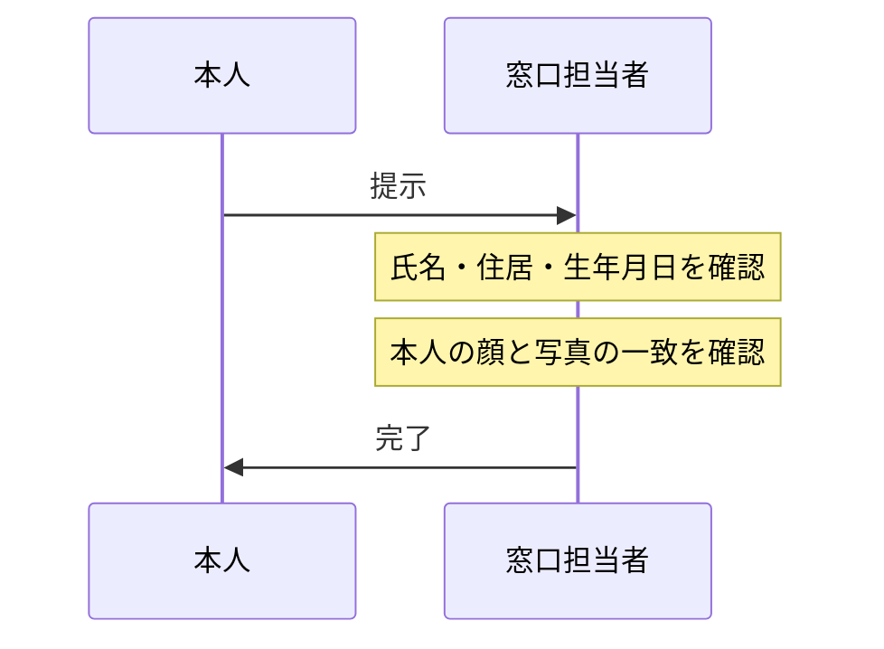
]

---

# 【方式ロ】写真なし書類提示 ＋ 転送不要郵便

.left-column[
### 概要
写真なし書類の提示を受け、かつ、住居宛に**転送不要郵便**を送付する方法。

### 対象書類
- 健康保険証（※経過措置期間に注意）
- 国民年金手帳
- 児童扶養手当証書 など
]

.right-column[
### 実務上のフロー
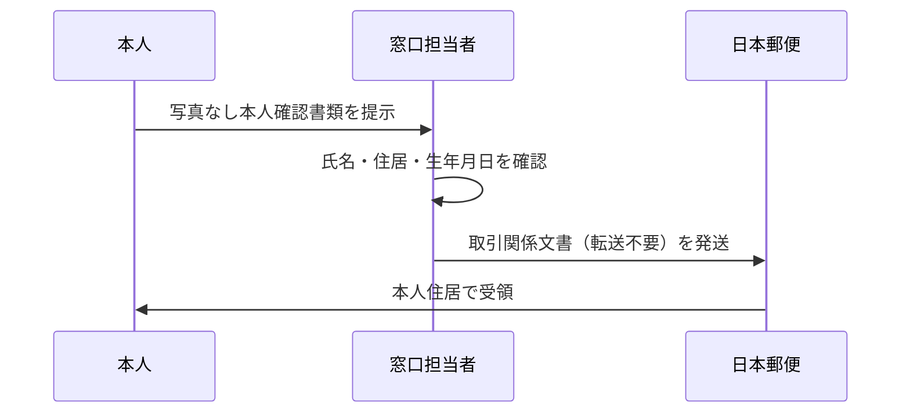
]

---

# 【方式ハ】書類2点の提示（対面）

.left-column[
### 概要
対面において、特定の書類を2点（または1点＋補完書類）提示受ける方法。

### パターン
1. **書類2点**: 住民票の写し ＋ 健康保険証 など
2. **書類1点 ＋ 補完書類**: 健康保険証 ＋ 公共料金領収書 など

### 補完書類とは
- 国税・地方税の領収書
- 公共料金（電気・ガス・水道）の領収書
- 発行から6ヶ月以内のものに限る
]

.right-column[
### 実務上のフロー
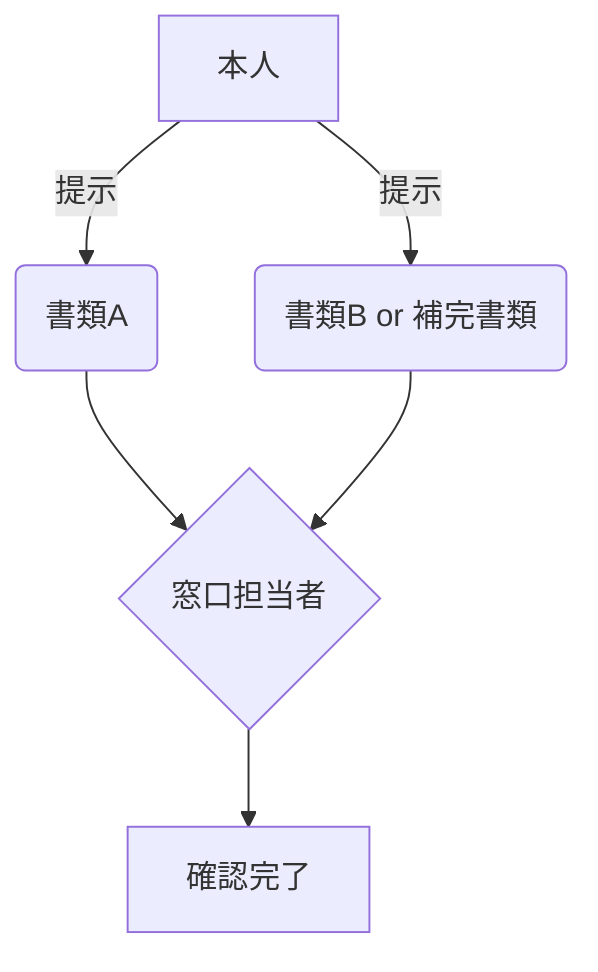
]

---

# 【方式ニ】書類1点提示 ＋ 他の書類（写し）の送付

.left-column[
### 概要
対面で1点（住民票等）提示を受け、かつ、別の書類の**送付（郵送等）**を受ける方法。

### ステップ
1. 対面で書類（例：住民票の写し）の提示を受ける。
2. 他の書類（例：健康保険証の写し）の送付を受ける。

### エンジニアの視点
- 対面チャネルと非対面チャネル（郵送・アップロード）の組み合わせ。
- データの突合ロジックが必要。
]

.right-column[
### データの流れ

]

---

# 【方式ホ】容貌の撮影 ＋ 写真付き書類の撮影

.left-column[
### 概要
アプリ等を使用して、**「本人の容貌」**と**「写真付き本人確認書類」**を撮影・送信する方法。

### ⚠️ 2027年4月 改正注意
- 本方式は**廃止**される予定です。
- 偽造書類による不正への対策として、ICチップ読み取り（ヘ）や公的個人認証（ル・ワ）への移行が求められます。
]

.right-column[
### eKYCフロー (セルフィー方式)
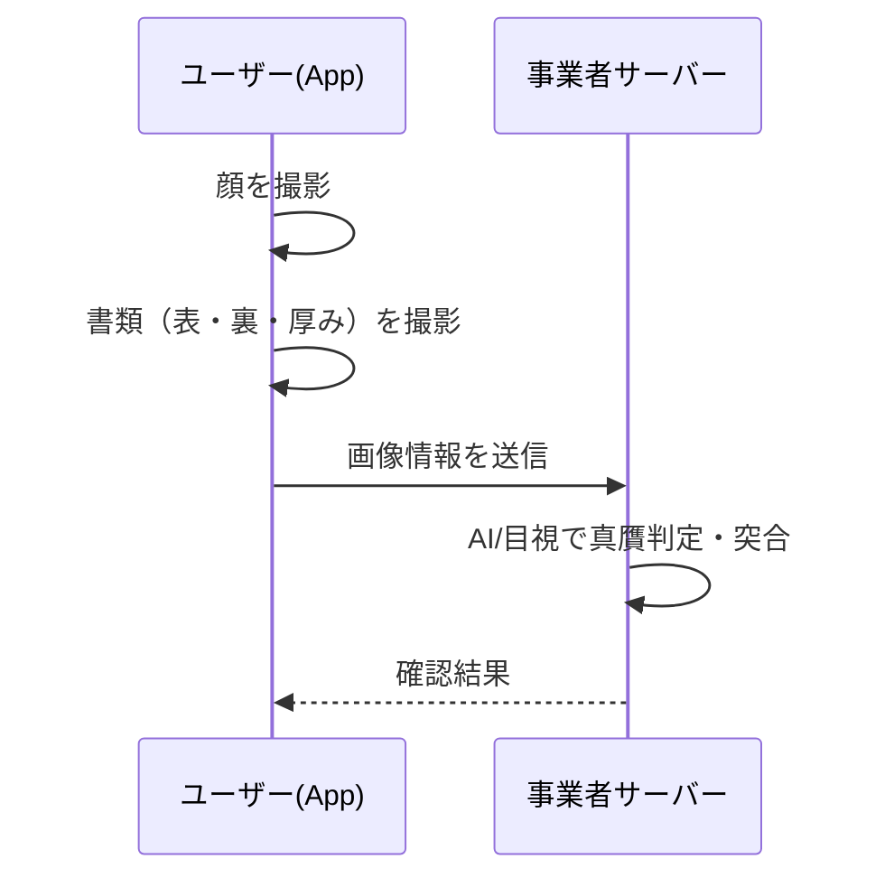
]

---

# 【方式ヘ】容貌の撮影 ＋ ICチップ情報の送信

.left-column[
### 概要
**「本人の容貌」**の撮影と、本人確認書類の**「ICチップ内情報」**の送信を組み合わせる方法。

### メリット
- 書類の偽造判定がICチップの署名検証で可能。
- 入力の手間が省ける（OCR不要）。
- 厚みの撮影が不要。
- **2027年以降も存続する主要な非対面方式**です。
]

.right-column[
### eKYCフロー (ICチップ読み取り)
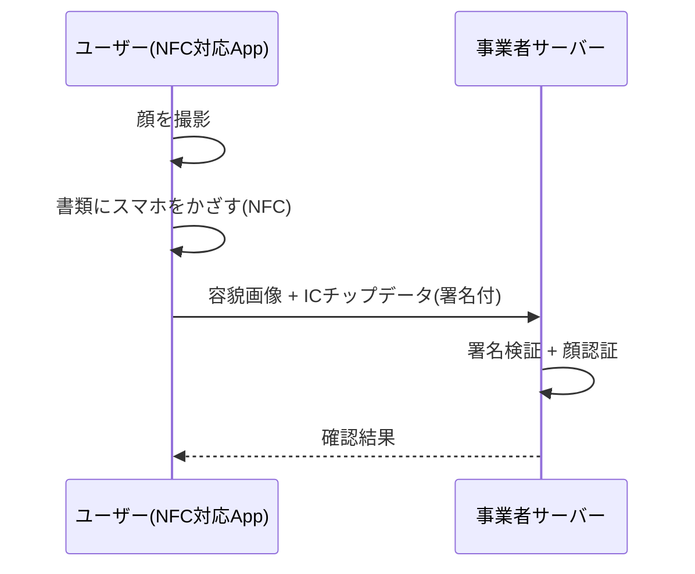
]

---

# 【方式ト】書類撮影/IC読み取り ＋ 振込等

.left-column[
### 概要
書類の撮影またはIC読み取りを行い、かつ、**他社での確認状況**や**預貯金口座への振込**を利用する方法。

### 2027年以降
- 書類撮影を用いるパターンは厳格化/廃止の方向ですが、ICチップ読み取りとの組み合わせは存続が期待されます。
]

.right-column[
### 振込による確認フロー (ト-2)
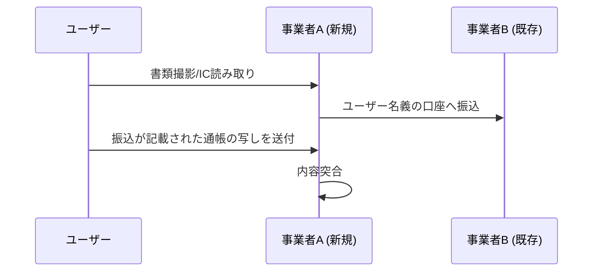
]

---

# 【方式チ】書類送付 ＋ 転送不要郵便

.left-column[
### 概要
本人確認書類の**「送付（郵送）」**を受け、かつ、その住居に**「転送不要郵便」**を送付する方法。

### 特徴
- 非対面での伝統的な郵送モデル。
- **2027年以降も存続**。ただし「写し」ではなく「原本（住民票等）」の送付が基本となります。
]

.right-column[
### 郵送サイクル
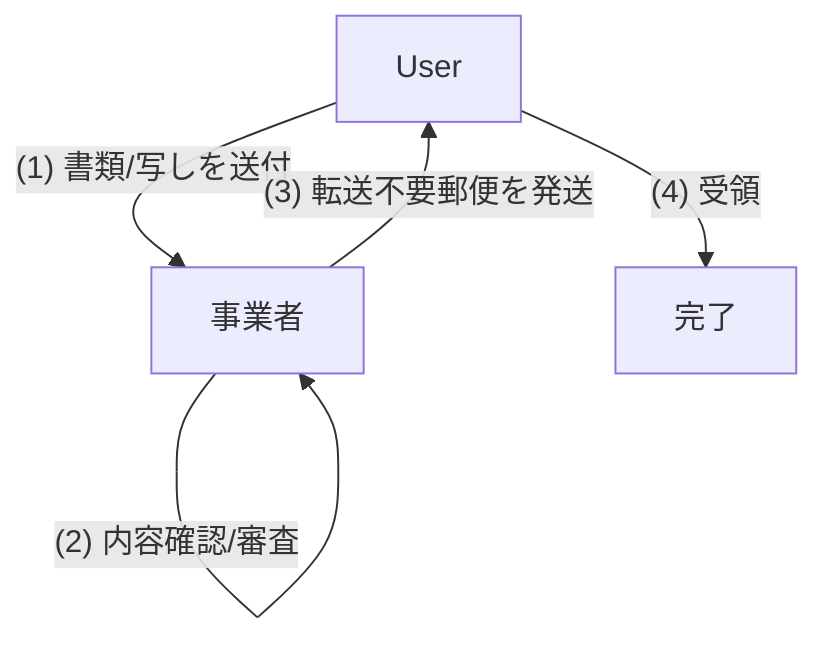
]

---

# 【方式リ・ヌ】書類（写し）の送付 ＋ 転送不要郵便

.left-column[
### 概要
書類の**「写し（コピー）」**を2点（または1点＋補完書類）送付受け、かつ、転送不要郵便を送る方法。

### ⚠️ 2027年4月 改正注意
- **方式「リ」は廃止**される予定です。
- 今後は「原本」の送付が必要になります。
]

.right-column[
### 概要図
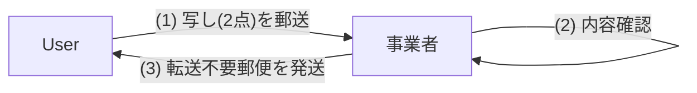
]

---

# 【方式ル】スマホ用電子証明書（マイナンバーカード代替）

.left-column[
### 概要
マイナンバーカードの機能をスマホに搭載した**「スマホ用電子証明書」**を利用して確認する方法。

### 導入の背景
- **2025年6月改正で追加**された最新の方式です。
- カードを持ち歩かなくても、スマホ完結で確実な本人確認が可能。
- **2027年以降の推奨方式**の一つです。
]

.right-column[
### フロー
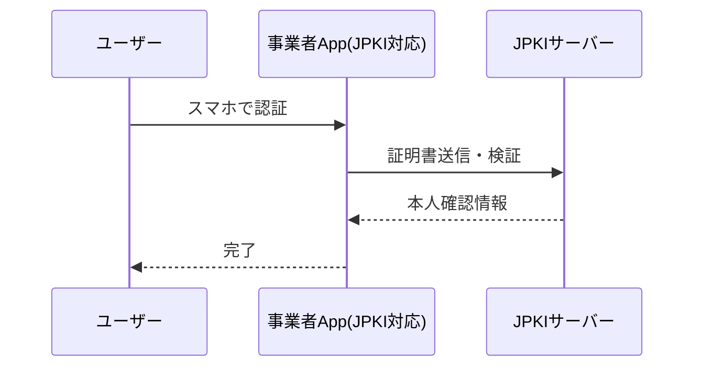
]

---

# 【方式ヲ】本人限定受取郵便（特定事項伝達型）

.left-column[
### 概要
郵便局員が対面で本人確認を行い、その結果を特定事業者に伝達することを条件に郵便物を送付する方法。

### 特徴
- 事業者が直接書類を見るのではなく、**郵便局が確認を代行**する形になる。
]

.right-column[
### フロー
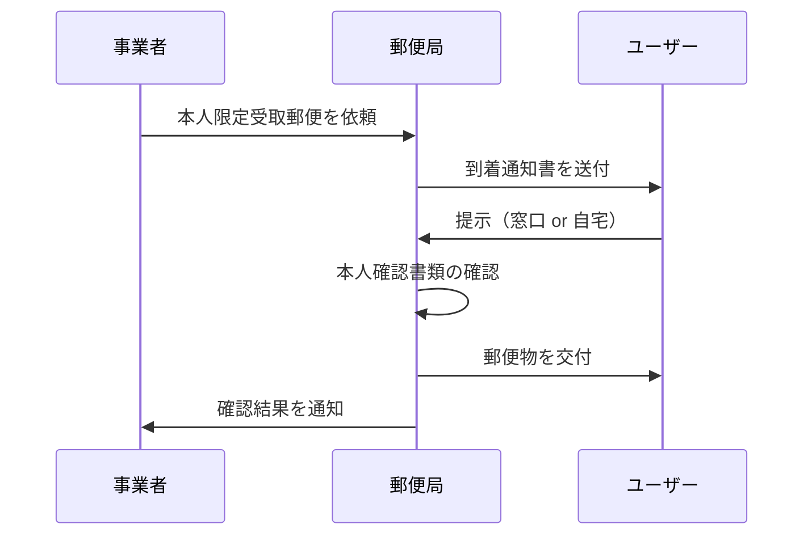
]

---

# 【方式ワ・カ・ヨ】電子署名・公的個人認証

.left-column[
### 概要
電子署名法に基づく電子署名、または公的個人認証（マイナンバーカード等）による**電子証明書**の送信を受ける方法。

### 2027年4月 改正予定
- **ワ方式（JPKI）は、今後の本人確認の「本命」**として一本化が推進されます。
- 改正により条文番号が「ヲ」などに変更される見込みです。
]

.right-column[
### デジタル認証の強み
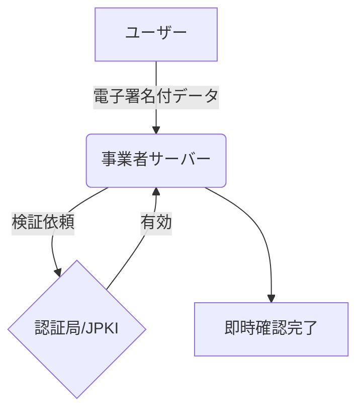
]

---

# 【二号】外国人の本人確認

.left-column[
### 概要
法第四条第一項第一号に規定する**外国人**（特定の取引を行う者）の確認方法。

### 確認書類
- **旅券（パスポート）**
- **乗員手帳**
- **船舶観光上陸許可書**

### 注意点
- 氏名、生年月日、特定の事項の記載があるものに限る。
]

.right-column[
### 確認ポイント
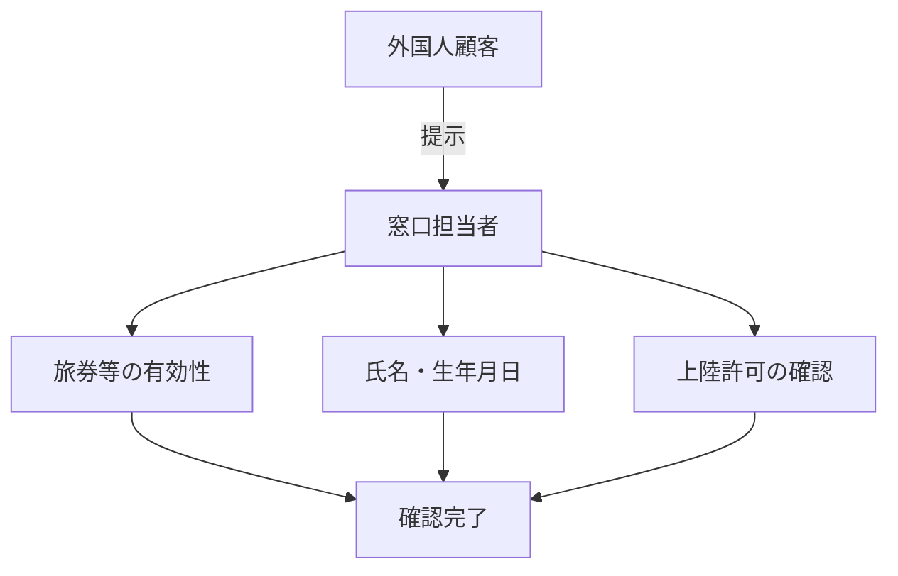
]

---

# 【三号イ・ニ】法人の本人確認（提示・郵送）

.left-column[
### 概要
法人の本人確認（名称・本店所在地）と、**代表者等**（来店者）の権限確認をセットで行う。

### 方式
- **イ（提示）**: 法人の本人確認書類（履歴事項全部証明書等）を提示。
- **ニ（郵送）**: 法人の本人確認書類（または写し）を送付 ＋ 本店等へ転送不要郵便。
]

.right-column[
### 実務構成
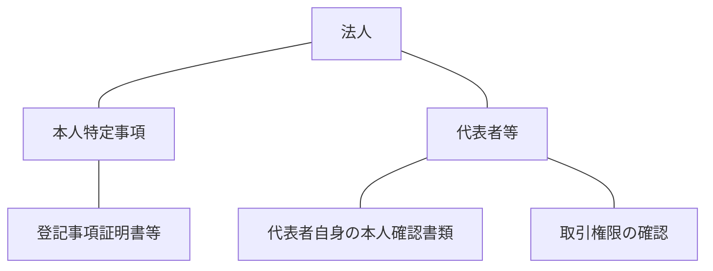
]

---

# 【三号ロ・ハ】法人の本人確認（API・公表事項）

.left-column[
### 概要
物理的な書類ではなく、**登記情報サービス**や**法人番号公表サイト**を利用して確認する方法。

### 方式
- **ロ**: 指定法人から**登記情報**の送信を受ける（＋非対面時は郵送）。
- **ハ**: **法人番号公表サイト**等の公表事項を確認（＋非対面時は郵送）。
]

.right-column[
### システム連携フロー
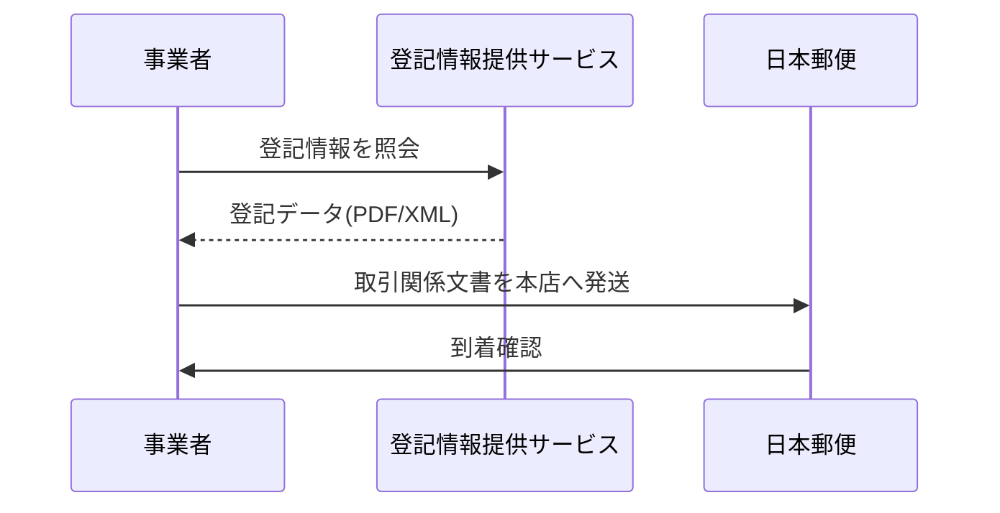
]

---

# 【三号ホ】法人の本人確認（電子証明書）

.left-column[
### 概要
登記官が作成した**電子証明書**（商業登記電子証明書）の送信を受ける方法。

### エンジニアの視点
- 法人の電子署名をシステムで検証可能。
- 郵送不要でオンライン完結の法人KYCを実現。
- 商業登記の電子署名検証ロジックの実装が必要。
]

.right-column[
### デジタル法人確認
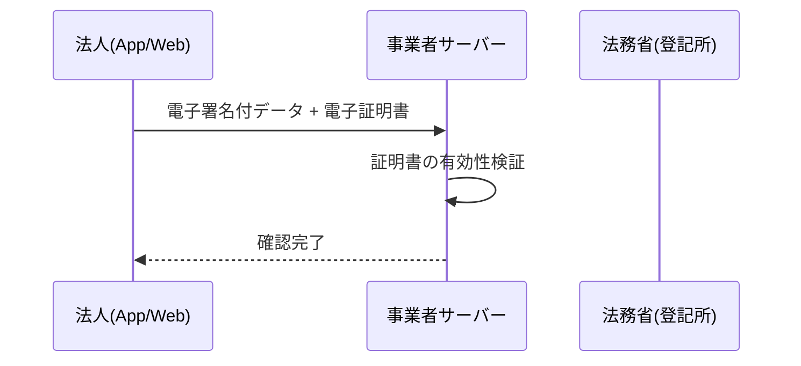
]

---

# 【二項】補完書類による住所確認

.left-column[
### 概要
本人確認書類に**「現在の住居」**の記載がない場合、追加で提示・送付を受ける書類。

### 主な補完書類
1. 国税・地方税の領収書・納税証明書
2. 社会保険料の領収書
3. 公共料金（電気・ガス・水道）の領収書
]

.right-column[
### 有効期限のルール
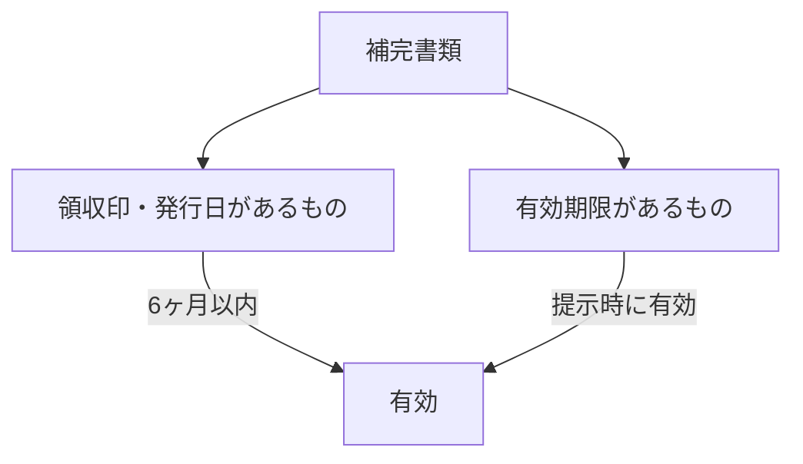
]

---

# 【三項・四項】営業所送付・役職員による交付

.left-column[
### 営業所への送付（三項）
- 法人顧客の場合、本店等ではなく**営業所**宛に取引関係文書を送付できる特例。

### 役職員による交付（四項）
- 郵送（書留・転送不要）に代えて、事業者の**役職員が直接赴いて**手渡しする方法。
]

.right-column[
### 役職員交付のフロー
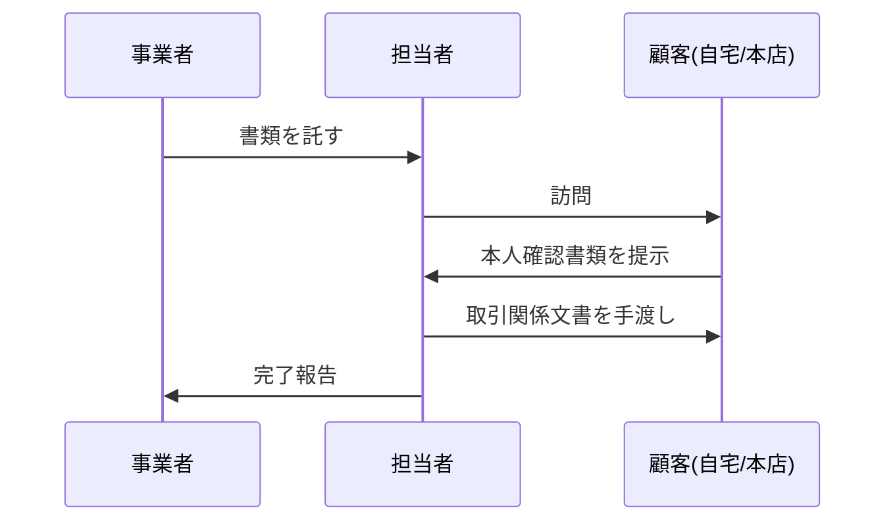
]

---

class: center, middle, inverse

# まとめ
## 適切な本人確認手段の選択

エンジニアとして、ビジネス要件（スピード、コスト、UX）と
リーガルリスク（確実性）のバランスを考慮し、
将来の改正を見据えた最適なKYCフローを設計しましょう。
