class: center, middle, inverse

# 犯罪収益移転防止法
## 本人確認手段（施行規則第六条）の解説
### eKYC導入検討エンジニア向け実務ガイド

---

# アジェンダ

1. **本人確認（KYC）の全体像**
2. **準拠バージョンと改正予定**
3. **自然人の本人確認手段**
4. **法人の本人確認手段**
5. **補完書類と実務上の留意点**
6. **2027年4月 改正前後 対照表**

---

class: center, middle, inverse

# 1. 本人確認（KYC）の全体像

---

# 1. 本人確認（KYC）の全体像

### 顧客確認（CDD）の重要性
- 特定事業者は、取引の開始時に顧客の本人特定事項を確認する義務があります。
- マネー・ローンダリングおよびテロ資金供与対策（AML/CFT）の基盤となります。

### 本人確認の三要素
1. **本人特定事項**: 氏名、住居、生年月日（自然人の場合）
2. **取引目的**: 取引を行う目的の確認
3. **職業・事業内容**: 顧客の属性確認

---

class: center, middle, inverse

# 2. 準拠バージョンと改正予定

---

# 2. 準拠バージョンと改正予定

### 準拠している条文
- **犯罪による収益の移転防止に関する法律施行規則（第六条）**
- **2025年（令和7年）6月施行分まで反映済み**
  - 第六条第一項第一号「ル」（スマホ版マイナ）を含む最新の内容です。

### 改正のロードマップ（2025年〜2027年）

| 時期 | 主な変更点 |
|------|------------|
| **2025年6月** | **方式「ル」の新設**: スマホ版マイナ（カード代替電磁的記録） |
| **2027年4月** | **大規模改正**: 写真撮影方式（ホ・リ・ハ・ニ）の廃止、IC読取の義務化。 |

---

# 2. 2027年4月 改正のポイント

2027年4月以降、**「券面の画像を送るだけ」の本人確認は原則廃止**され、ICチップ活用が必須となります。

### 主な変更点
- **券面撮影方式の廃止**: 偽造対策のため、スマホカメラによる撮影（ホ方式等）が認められなくなります。
- **ICチップ活用の義務化**: 対面・非対面を問わず、ICチップ情報の読み取りが原則必須となります。
- **方式記号の再編**: 大幅な条文番号の振り直しが行われます（例：JPKIがワ→ヌ等）。

---

class: center, middle, inverse

# 3. 自然人の本人確認手段

---

# 3. 自然人の本人確認手段（分類）

| 分類 | 方式（号） | 概要 |
|:---|:---:|:---|
| **対面方式** | イ、ハ | 窓口等で書類を直接提示。 |
| **郵送方式** | ロ、チ、リ、ヌ、ヲ | 書類送付 ＋ 転送不要郵便。 |
| **対面・郵送併用** | ニ | 対面提示 ＋ 他の書類送付。 |
| **eKYC方式** | ホ、ヘ、ト | スマホ等で容貌・書類・ICを送信。 |
| **デジタル方式** | ル、ワ、カ、ヨ | 公的個人認証、電子署名、スマホ証明書。 |

---

class: center, middle, inverse

# 3.1 対面・郵送方式

---

# 【方式イ】写真付き書類の提示（対面）

.left-column[
### 概要
本人（または代表者等）から、**写真付き本人確認書類**の提示を直接受ける方法。

### 対象書類
- 運転免許証
- マイナンバーカード
- 在留カード
- 官公庁発行の顔写真付き書類
]

.right-column[
### フロー
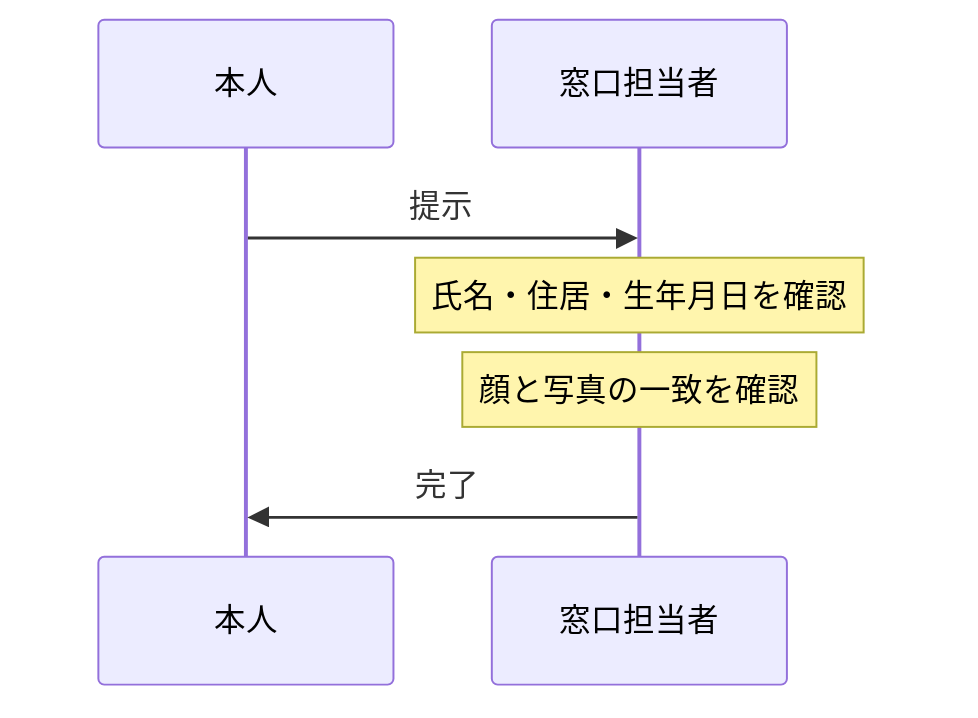
```mermaid
sequenceDiagram
    participant User as 本人
    participant Staff as 窓口担当者
    User->>Staff: 提示
    Note over Staff: 氏名・住居・生年月日を確認
    Note over Staff: 顔と写真の一致を確認
    Staff->>User: 完了
```
]

---

# 方式「リ」と「ヌ」の違い

どちらも「書類の写し」を利用しますが、**「誰が」**送付し、**「誰を」**確認するかが異なります。

| 項目 | 方式「リ」 | 方式「ヌ」 |
|:---|:---|:---|
| **対象者** | 個人（一般顧客） | 法人の被用者等（従業員など） |
| **送付者** | 本人 | その者が所属する法人 |
| **書類の数** | 写し**2点**（または写し1点+補完1点） | 写し**1点** + 法人による証明 |
| **2027年改正** | **廃止**（成りすましリスク高） | **存続**（新「ヘ」方式） |

- **ポイント**: 方式「ヌ」は、法人が「この者は当社の社員です」と保証するプロセスが含まれるため、個人単独の「リ」よりも信頼度が高いとみなされています。

---

# 【方式ロ】写真なし書類提示 ＋ 転送不要郵便

.left-column[
### 概要
写真なし書類の提示を受け、かつ、住居宛に**転送不要郵便**を送付する方法。

### 対象書類
- 健康保険証（※経過措置あり）
- 国民年金手帳
- 児童扶養手当証書 など
]

.right-column[
### フロー
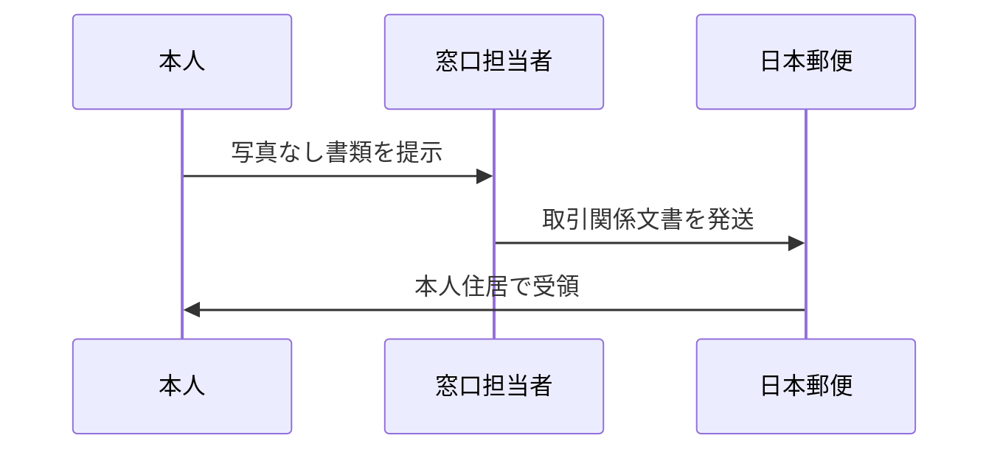
```mermaid
sequenceDiagram
    participant User as 本人
    participant Staff as 窓口担当者
    participant Post as 日本郵便
    User->>Staff: 写真なし書類を提示
    Staff->>Post: 取引関係文書を発送
    Post->>User: 本人住居で受領
```
]

---

# 【方式ハ】書類2点の提示（対面）

.left-column[
### 概要
対面において、特定の書類を2点（または1点＋補完書類）提示受ける方法。

### パターン
1. **書類2点**: 住民票の写し ＋ 健康保険証 など
2. **書類1点 ＋ 補完書類**: 健康保険証 ＋ 公共料金領収書 など
]

.right-column[
### フロー
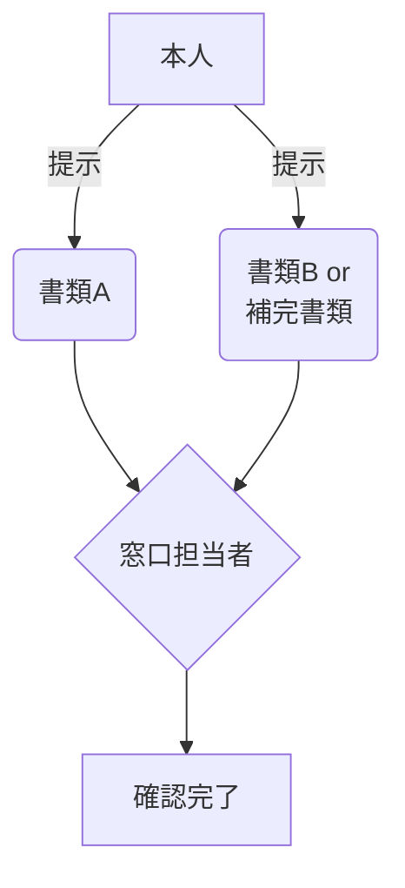
```mermaid
graph TD
    User[本人] -->|提示| DocA(書類A)
    User -->|提示| DocB(書類B or<br/>補完書類)
    DocA --> Staff{窓口担当者}
    DocB --> Staff
    Staff --> Done[確認完了]
```
]

---

# 【方式ニ】書類1点提示 ＋ 他の書類（写し）の送付

.left-column[
### 概要
対面で1点提示を受け、かつ、別の書類の**送付（郵送等）**を受ける方法。

### ステップ
1. 対面で書類（例：住民票の写し）の提示を受ける。
2. 他の書類（例：健康保険証の写し）の送付を受ける。
]

.right-column[
### フロー
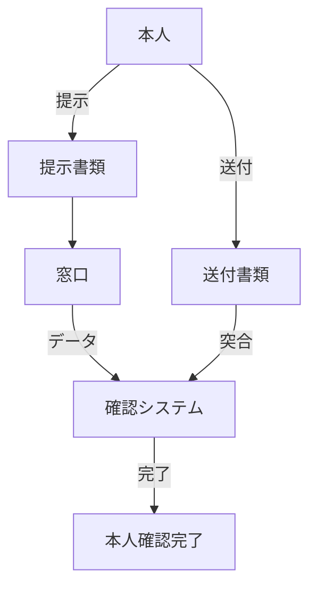
```mermaid
graph TD
    User[本人]
    Counter[窓口]
    Doc1[提示書類]
    Doc2[送付書類]
    System[確認システム]

    User -->|提示| Doc1
    Doc1 --> Counter
    User -->|送付| Doc2
    Counter -->|データ| System
    Doc2 -->|突合| System
    System -->|完了| Done[本人確認完了]
```
]

---

# 【方式チ】書類送付 ＋ 転送不要郵便

.left-column[
### 概要
本人確認書類の**「送付（郵送）」**を受け、かつ、その住居に**「転送不要郵便」**を送付する方法。

### 特徴
- 非対面での伝統的な郵送モデル。
- **2027年以降も存続**（原本送付が基本）。
]

.right-column[
### フロー
```mermaid
graph TD
    User[ユーザー]
    Biz[事業者]
    Doc[本人確認書類(原本)]
    Mail[転送不要郵便]

    User -->|送付| Doc
    Doc --> Biz
    Biz -->|審査| Biz
    Biz -->|発送| Mail
    Mail -->|到着| User
```
]

---

# 【方式リ】書類（写し）の送付 ＋ 転送不要郵便

.left-column[
### 概要
書類の**「写し」**を2点送付受け、かつ、転送不要郵便を送る方法。

### ⚠️ 2027年4月 改正注意
- **方式「リ」は廃止**される予定です。
- 非対面の郵送方式は、原本（住民票等）を送付する「チ方式」へ一本化されます。
]

.right-column[
### フロー
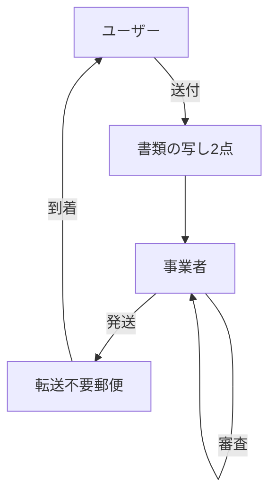
```mermaid
graph TD
    User[ユーザー]
    Biz[事業者]
    Copy[書類の写し2点]
    Mail[転送不要郵便]

    User -->|送付| Copy
    Copy --> Biz
    Biz -->|審査| Biz
    Biz -->|発送| Mail
    Mail -->|到着| User
```
]

---

# 【方式ヌ】法人の被用者等による写し送付

.left-column[
### 概要
**法人の被用者等（従業員等）**が顧客となる場合に、その法人が権限を証明し、本人確認書類の写しを送付する方法。

### 特徴
- 職域での契約（団体契約等）で利用される。
- 被用者本人からではなく、法人の担当部署等からまとめて書類が届く場合も含む。
]

.right-column[
### フロー
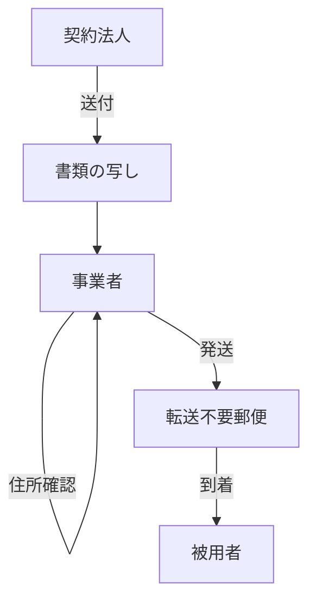
```mermaid
graph TD
    Corp[契約法人]
    Biz[事業者]
    Copy[書類の写し]
    Mail[転送不要郵便]
    User[被用者]

    Corp -->|送付| Copy
    Copy --> Biz
    Biz -->|住所確認| Biz
    Biz -->|発送| Mail
    Mail -->|到着| User
```
]

---

# 【方式ヲ】本人限定受取郵便（特定事項伝達型）

.left-column[
### 概要
郵便局員が対面で本人確認を行い、その結果を特定事業者に伝達することを条件に郵便物を送付する方法。

### 特徴
- 事業者が直接書類を見るのではなく、**郵便局が確認を代行**する形になる。
]

.right-column[
### フロー
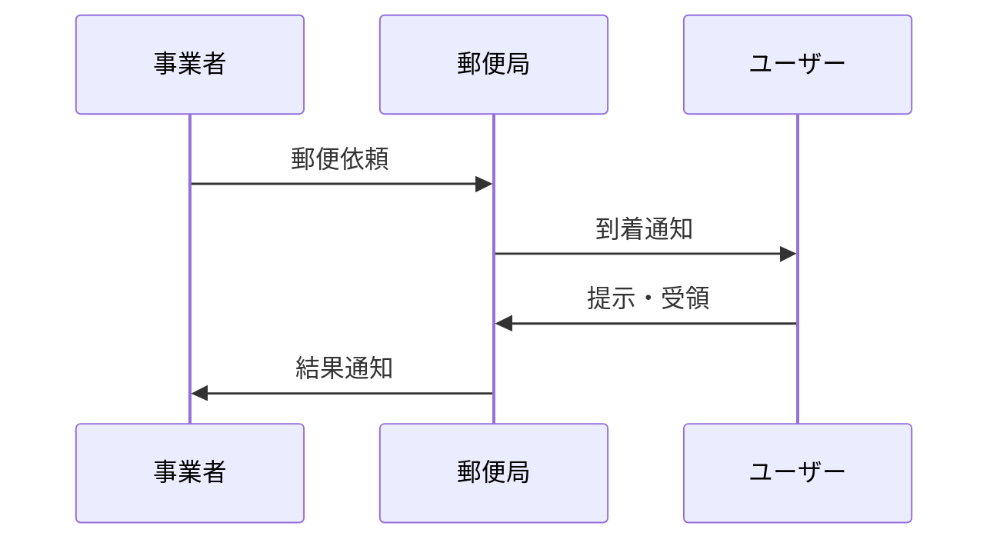
```mermaid
sequenceDiagram
    participant Biz as 事業者
    participant Post as 郵便局
    participant User as ユーザー
    Biz->>Post: 郵便依頼
    Post->>User: 到着通知
    User->>Post: 提示・受領
    Post->>Biz: 結果通知
```
]

---

# 方式「リ」と「ヌ」の違い

郵送で「書類の写し（コピー）」を送る点は共通ですが、**「誰が」「どのような取引で」**使えるかが異なります。

| 項目 | 方式「リ」 | 方式「ヌ」 |
|:---|:---|:---|
| **対象者** | 一般の個人顧客 | 法人の被用者（従業員）等 |
| **必要書類** | 写し**2点**（または写し1点＋補完書類） | 写し**1点** |
| **前提条件** | 特になし | 特定の法人取引（給与振込口座等）に限る |
| **2027年改正** | **廃止**（原本送付の「チ」へ） | **存置**（新「チ」方式へ） |

- **ポイント**: ヌ方式は、法人が身元をある程度保証している（給与振込等）ため、リ方式よりも簡素化（書類1点）されています。

---

class: center, middle, inverse

# 3.2 eKYC方式

---

# 【方式ホ】容貌の撮影 ＋ 写真付き書類の撮影

.left-column[
### 概要
アプリ等を使用して、**「本人の容貌」**と**「写真付き本人確認書類」**を撮影・送信する方法。

### ⚠️ 2027年4月 改正注意
- 本方式は**廃止**される予定です。
- ICチップ読み取り（ヘ）や公的個人認証（ル〜ヨ）への移行が求められます。
]

.right-column[
### フロー
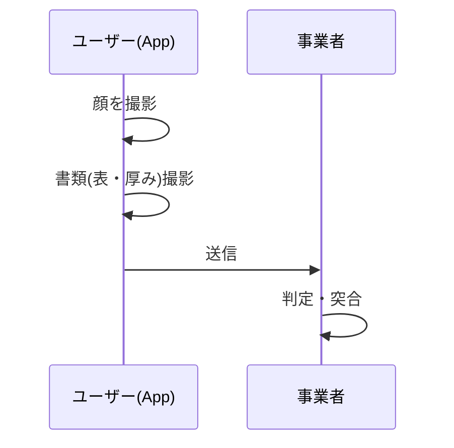
```mermaid
sequenceDiagram
    participant User as ユーザー(App)
    participant Server as 事業者
    User->>User: 顔を撮影
    User->>User: 書類(表・厚み)撮影
    User->>Server: 送信
    Server->>Server: 判定・突合
```
]

---

# 【方式ヘ】容貌の撮影 ＋ ICチップ情報の送信

.left-column[
### 概要
**「本人の容貌」**の撮影と、本人確認書類の**「ICチップ内情報」**の送信を組み合わせる方法。

### メリット
- 書類の偽造判定がICチップの署名検証で可能。
- 入力の手間が省ける。
- **2027年以降も存続する主要な非対面方式**。
]

.right-column[
### フロー
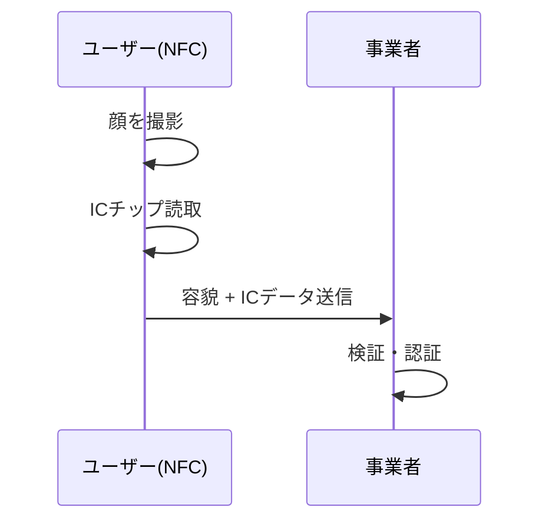
```mermaid
sequenceDiagram
    participant User as ユーザー(NFC)
    participant Server as 事業者
    User->>User: 顔を撮影
    User->>User: ICチップ読取
    User->>Server: 容貌 + ICデータ送信
    Server->>Server: 検証・認証
```
]

---

# 【方式ト(1)】書類撮影/IC読取 ＋ 金融機関API

.left-column[
### 概要
**「書類撮影またはIC読取」**を行い、かつ、**「他の特定事業者が確認済みの情報」**をAPI等を通じて確認する方法。

### ステップ
1. 書類（またはICチップ）により本人確認。
2. 他の金融機関（銀行等）からAPIで情報提供を受ける。
]

.right-column[
### フロー
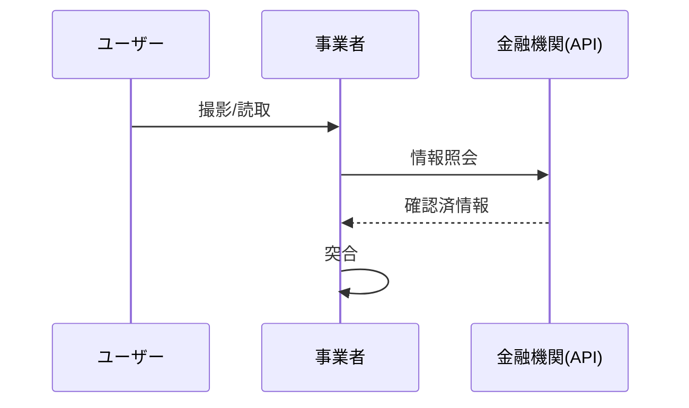
```mermaid
sequenceDiagram
    participant User as ユーザー
    participant Biz as 事業者
    participant Bank as 金融機関(API)
    User->>Biz: 撮影/読取
    Biz->>Bank: 情報照会
    Bank-->>Biz: 確認済情報
    Biz->>Biz: 突合
```
]

---

# 【方式ト(2)】書類撮影/IC読取 ＋ 銀行振込

.left-column[
### 概要
**「書類撮影またはIC読取」**を行い、かつ、顧客の預貯金口座へ**「少額振込」**等を行うことで確認する方法。

### 確認の組み合わせ
- 書類撮影/IC読取
- ＋ 顧客口座への振込
- ＋ **預貯金通帳の写し**等の送付
]

.right-column[
### フロー
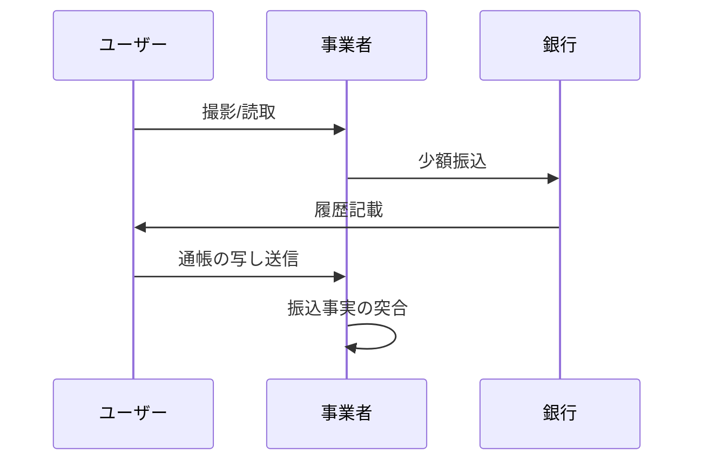
```mermaid
sequenceDiagram
    participant User as ユーザー
    participant Biz as 事業者
    participant Bank as 銀行
    User->>Biz: 撮影/読取
    Biz->>Bank: 少額振込
    Bank->>User: 履歴記載
    User->>Biz: 通帳の写し送信
    Biz->>Biz: 振込事実の突合
```
]

---

class: center, middle, inverse

# 3.3 デジタル認証方式

---

# 【方式ル】スマホ用電子証明書の送信

.left-column[
### 概要
マイナンバーカードの機能をスマホに搭載した**「スマホ用電子証明書」**を利用して確認する方法。

### 導入の背景
- **2025年6月改正で追加**。
- カードを持ち歩かなくても、スマホ完結で確実な本人確認が可能。
]

.right-column[
### フロー
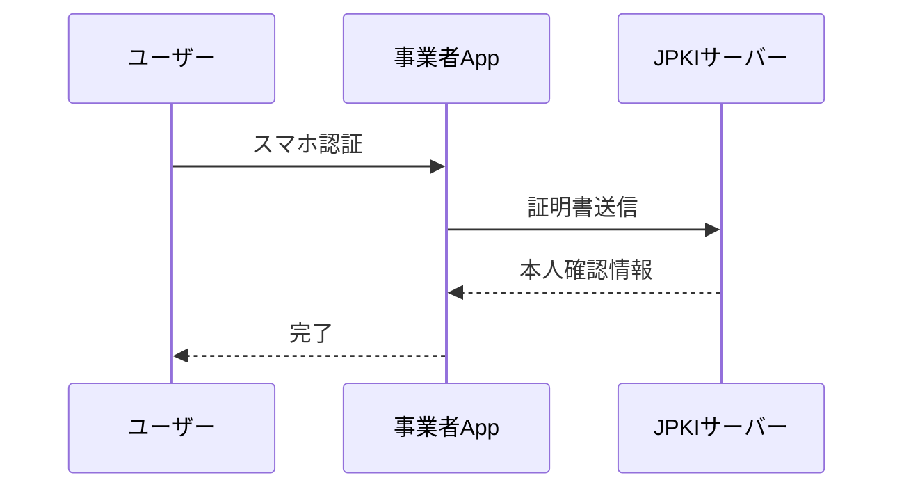
```mermaid
sequenceDiagram
    participant User as ユーザー
    participant App as 事業者App
    participant JPKI as JPKIサーバー
    User->>App: スマホ認証
    App->>JPKI: 証明書送信
    JPKI-->>App: 本人確認情報
    App-->>User: 完了
```
]

---

# 【方式カ】公的個人認証（JPKI）

.left-column[
### 概要
マイナンバーカードのICチップ内の**「署名用電子証明書」**を利用して本人確認を行う方法。

### 特徴
- 署名用パスワード（6〜16桁）が必要。
- **最も信頼性が高く、即時に確認が完了**。
- 2027年以降、非対面KYCの主軸。
]

.right-column[
### フロー
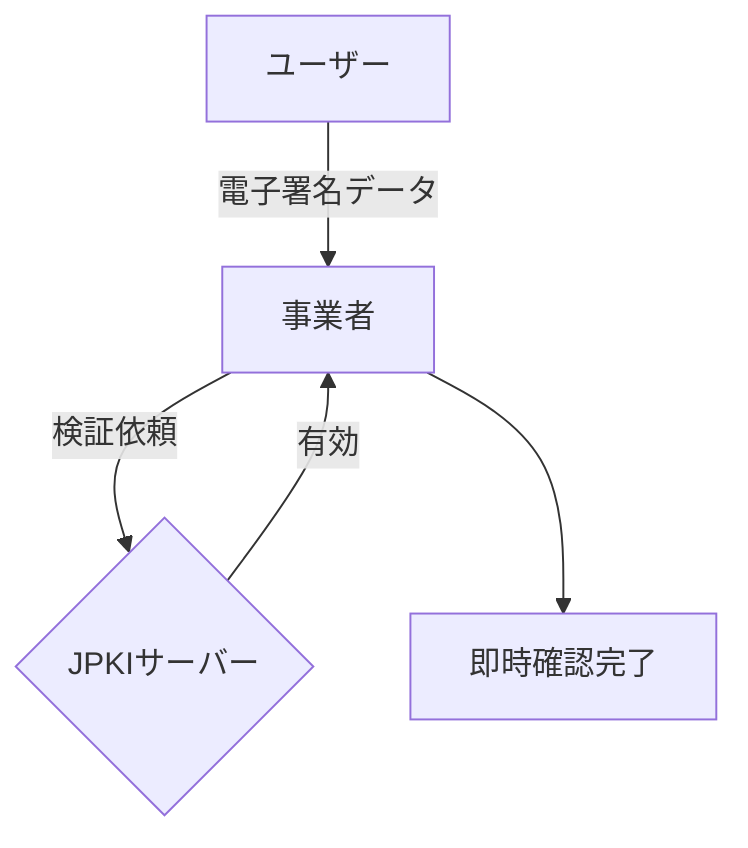
```mermaid
graph TD
    User[ユーザー] -->|電子署名データ| Biz[事業者]
    Biz -->|検証依頼| JPKI{JPKIサーバー}
    JPKI -->|有効| Biz
    Biz --> Done[即時確認完了]
```
]

---

# 【方式ワ・ヨ】その他の電子署名方式

.left-column[
### 方式「ワ」：認定電子署名
- 民間の認定認証事業者（CA）が発行する電子証明書を利用。
- 主にB2B取引や商業登記などで利用される証明書。

### 方式「ヨ」：特定電子署名
- 犯収法に基づき大臣が個別に認めた証明書。
]

.right-column[
### 特徴
- どちらも「デジタル署名」を用いた非対面完結方式。
- JPKI（カ方式）に比べると、一般消費者の利用ハードルは高い。
]

---

# 方式「ワ」「カ」「ヨ」の違い

これらはすべて「電子署名」を利用するデジタル完結方式ですが、**「どの法律に基づく証明書か」**が異なります。

| 項目 | 方式「カ」 | 方式「ワ」 | 方式「ヨ」 |
|:---|:---|:---|:---|
| **通称** | **公的個人認証 (JPKI)** | **認定電子署名** | **特定電子署名** |
| **根拠法** | 公的個人認証法 | 電子署名法（認定） | 犯収法施行規則 |
| **発行体** | J-LIS（地方公共団体） | 民間認定事業者（セコム等） | 認定を受けた特定事業者 |
| **主な証明書** | マイナンバーカード | 商業登記用電子証明書など | 特定のeKYC用証明書 |
| **2027年改正** | **新「ヌ」方式**へ | **新「リ」方式**へ | **新「ル」方式**へ |

- **実務上の選択**: 一般個人向けには、普及率の高い**「カ（JPKI）」**が最も一般的です。

---

---

class: center, middle, inverse

# 4. 法人の本人確認手段

---

# 4. 法人の本人確認手段（分類）

| 分類 | 方式（号） | 概要 |
|:---|:---:|:---|
| **対面・郵送方式** | 三号イ、ニ | 本人確認書類の提示または送付。 |
| **外部照会方式** | 三号ロ、ハ | 登記情報提供サービスや法人番号サイトの利用。 |
| **デジタル方式** | 三号ホ | 商業登記電子証明書の送信。 |

---

class: center, middle, inverse

# 4.1 対面・郵送方式

---

# 【三号イ・ニ】法人の本人確認（提示・郵送）

.left-column[
### 概要
法人の本人確認（名称・本店所在地）と、**代表者等**（来店者）の権限確認をセットで行う。

### 方式
- **イ（提示）**: 書類（登記事項証明書等）を提示。
- **ニ（郵送）**: 書類を送付 ＋ 本店等へ転送不要郵便。
]

.right-column[
### フロー
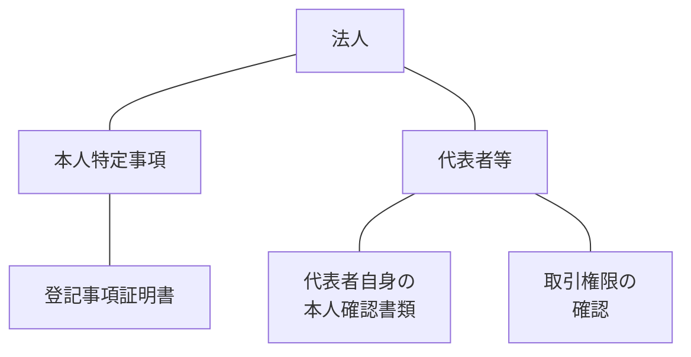
```mermaid
graph TD
    Corp[法人] --- Identity[本人特定事項]
    Corp --- Rep[代表者等]
    Identity --- Doc1[登記事項証明書]
    Rep --- Doc2[代表者自身の<br/>本人確認書類]
    Rep --- Power[取引権限の<br/>確認]
```
]

---

class: center, middle, inverse

# 4.2 外部照会方式

---

# 【三号ロ・ハ】法人の本人確認（API・公表事項）

.left-column[
### 概要
物理的な書類ではなく、外部サービスを利用して確認する方法。

### 方式
- **ロ**: **登記情報提供サービス**から登記情報の送信を受ける（＋郵送）。
- **ハ**: **法人番号公表サイト**等を確認（＋郵送）。
]

.right-column[
### フロー
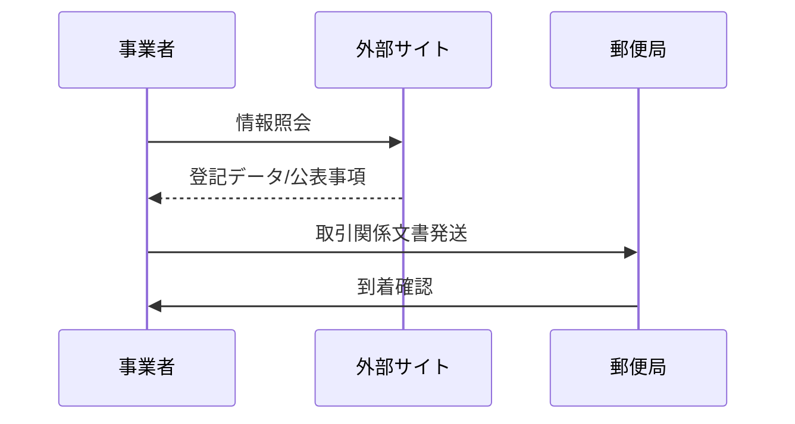
```mermaid
sequenceDiagram
    participant Biz as 事業者
    participant Reg as 外部サイト
    participant Post as 郵便局
    Biz->>Reg: 情報照会
    Reg-->>Biz: 登記データ/公表事項
    Biz->>Post: 取引関係文書発送
    Post->>Biz: 到着確認
```
]

---

class: center, middle, inverse

# 4.3 デジタル方式

---

# 【三号ホ】法人の本人確認（電子証明書）

.left-column[
### 概要
登記官が作成した**電子証明書**（商業登記電子証明書）の送信を受ける方法。

### 特徴
- 法人の電子署名をシステムで自動検証可能。
- 完全オンライン完結の法人KYCを実現。
]

.right-column[
### フロー
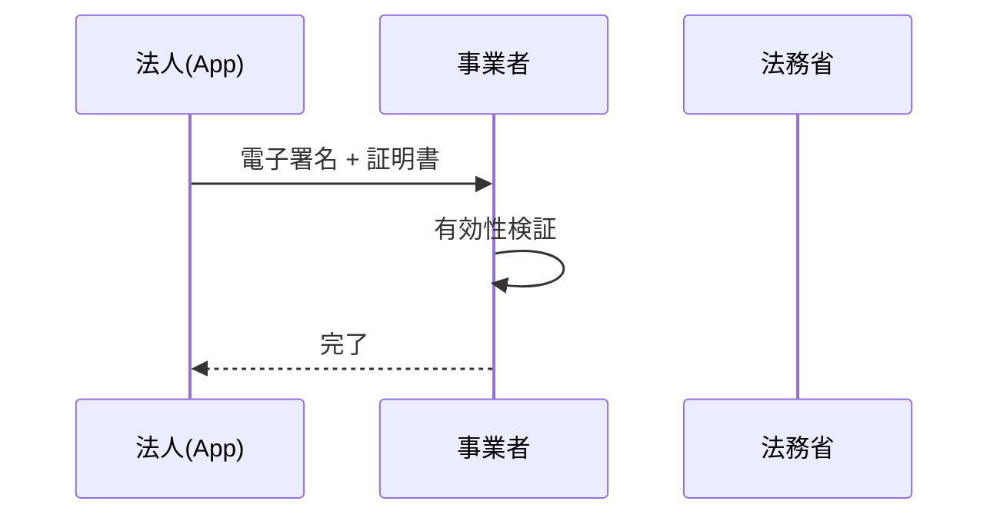
```mermaid
sequenceDiagram
    participant Corp as 法人(App)
    participant Biz as 事業者
    participant MOJ as 法務省
    Corp->>Biz: 電子署名 + 証明書
    Biz->>Biz: 有効性検証
    Biz-->>Corp: 完了
```
]

---

class: center, middle, inverse

# 4.4 外国人の本人確認

---

# 【二号】外国人の本人確認

.left-column[
### 概要
法第四条第一項第一号に規定する**外国人**（特定の取引を行う者）の確認方法。

### 確認書類
- **旅券（パスポート）**
- **乗員手帳**
- **船舶観光上陸許可書**
]

.right-column[
### フロー
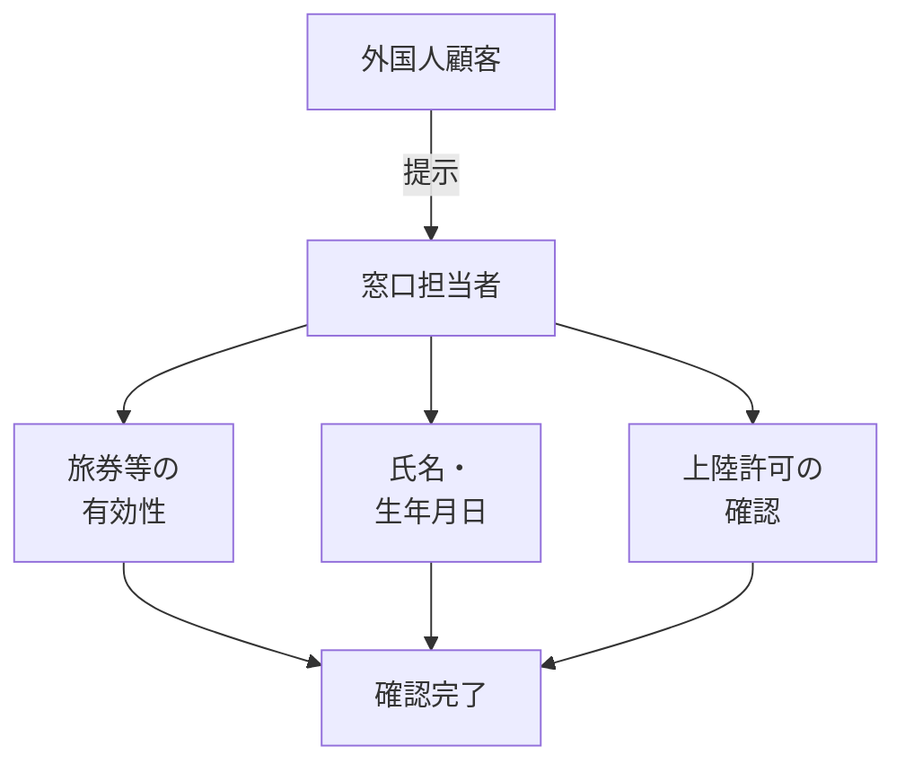
```mermaid
graph TD
    User[外国人顧客] -->|提示| Staff[窓口担当者]
    Staff --> Check1[旅券等の<br/>有効性]
    Staff --> Check2[氏名・<br/>生年月日]
    Staff --> Check3[上陸許可の<br/>確認]
    Check1 & Check2 & Check3 --> Done[確認完了]
```
]

---

class: center, middle, inverse

# 5. 補完書類と実務上の留意点

---

# 5. 補完書類と実務上の留意点

.left-column[
### 【二項】補完書類
本人確認書類に**「現在の住居」**の記載がない場合に追加する書類。

### 主な種類
- 納税証明書、領収書
- 社会保険料の領収書
- 公共料金の領収書
]

.right-column[
### ルール
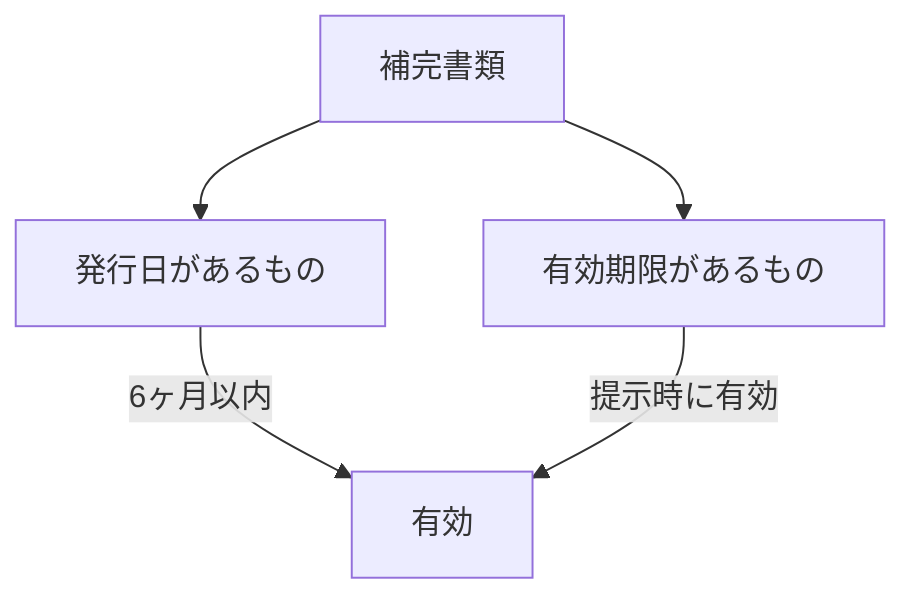
```mermaid
graph TD
    Sub[補完書類] --> TypeA[発行日があるもの]
    Sub --> TypeB[有効期限があるもの]
    TypeA -->|6ヶ月以内| OK[有効]
    TypeB -->|提示時に有効| OK
```
]

---

# 【三項・四項】営業所送付・役職員による交付

.left-column[
### 営業所への送付（三項）
- 法人顧客の場合、本店等ではなく**営業所**宛に取引関係文書を送付できる。

### 役職員による交付（四項）
- 郵送に代えて、事業者の**役職員が直接赴いて**手渡しする方法。
]

.right-column[
### フロー
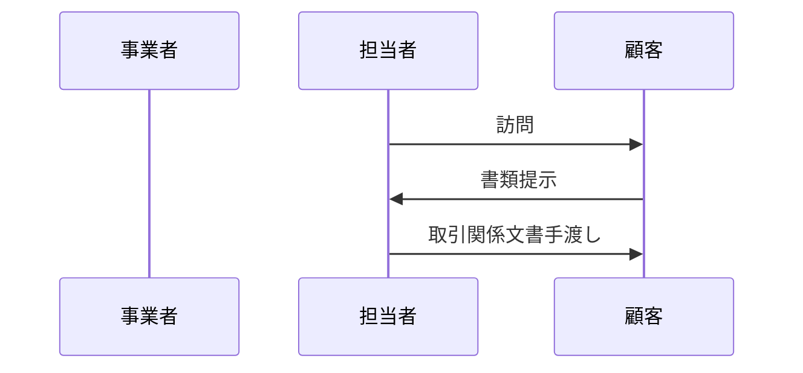
```mermaid
sequenceDiagram
    participant Biz as 事業者
    participant Staff as 担当者
    participant User as 顧客
    Staff->>User: 訪問
    User->>Staff: 書類提示
    Staff->>User: 取引関係文書手渡し
```
]

---

class: center, middle, inverse

# 6. 2027年4月 改正前後 対照表

---

# 【付録】2027年4月 改正前後の方式対照表(1/3)

| 現行方式 | 改正後 | 概要 | 変更内容・備考 |
|:---:|:---:|:---|:---|
| **イ** | **イ** | 写真付き提示（対面） | **ICチップ読取が義務化**。券面目視のみは不可。 |
| **ロ** | **ロ** | 写真なし提示＋郵送 | ロ(1)ICなし写真IDまたは住民票(原本)、ロ(2)非写真ICに分化。 |
| **ハ** | **廃止** | 書類2点提示（対面） | **廃止**。健康保険証の廃止等に伴い整理。 |
| **ニ** | **廃止** | 1点提示＋写し送付 | **廃止**。 |
| **ホ** | **廃止** | 容貌 ＋ 書類撮影 | **廃止**。券面の写真撮影（厚み等）による確認は不可に。 |
| **ヘ** | **ハ** | 容貌 ＋ ICチップ | **新「ハ」方式**。券面撮影が廃止され、IC読取が必須化。 |
| **ト** | **ニ** | IC読取 ＋ API/振込 | **新「ニ」方式**。券面撮影が廃止され、IC読取または原本が必須化。 |

---

# 【付録】2027年4月 改正前後の方式対照表(2/3)

| 現行方式 | 改正後 | 概要 | 変更内容・備考 |
|:---:|:---:|:---|:---|
| **チ** | **ホ** | 原本送付 ＋ 郵送 | **新「ホ」方式**。写しの送付は廃止、原本またはIC。 |
| **リ** | **廃止** | 写し送付 ＋ 郵送 | **廃止**。写し（コピー）による郵送確認は不可。 |
| **ヌ** | **ヘ** | 被用者等写し ＋ 郵送 | **新「ヘ」方式**。 |
| **ル** | **ト** | スマホ版マイナ | **新「ト」方式**。カード代替電磁的記録。 |
| **ヲ** | **チ** | 本人限定受取郵便 | **新「チ」方式**。受取時のICチップ読取（またはスマホマイナ）必須。 |
| **ワ** | **リ** | 認定電子署名 | **新「リ」方式**。 |
| **カ** | **ヌ** | 公的個人認証(JPKI) | **新「ヌ」方式**。 |
| **ヨ** | **ル** | 特定電子署名 | **新「ル」方式**。 |

---

# 【付録】2027年4月 改正前後の方式対照表(3/3)

| 現行方式 | 改正後 | 概要 | 変更内容・備考 |
|:---:|:---:|:---|:---|
| **(新)** | **ヲ** | 住基非適用者(対面) | 新設。海外居住者等向けの対面特例。券面目視のみ。 |
| **(新)** | **ワ** | 住基非適用者(特例1) | 新設。海外居住者等向けの郵送特例（原本 or 写し撮影）。 |
| **(新)** | **カ** | 住基非適用者(特例2) | 新設。海外居住者等向けの郵送特例（写し2点）。 |
| **二号** | **二号** | 外国人の本人確認 | 変更なし。 |
| **三号イ〜ホ**| **三号イ〜ホ**| 法人の本人確認 | 基本的な枠組みは維持。 |
| **三号ニ** | **三号ニ** | 法人書類郵送 | **写しの利用が不可**となり、原本のみに限定。 |
| **三・四項** | **三・四項** | 営業所送付・役職員交付 | 変更なし。 |

---

class: center, middle, inverse

# まとめ
## 適切な本人確認手段の選択

エンジニアとして、ビジネス要件（スピード、コスト、UX）と
リーガルリスク（確実性）のバランスを考慮し、
将来の改正を見据えた最適なKYCフローを設計しましょう。
